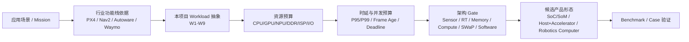
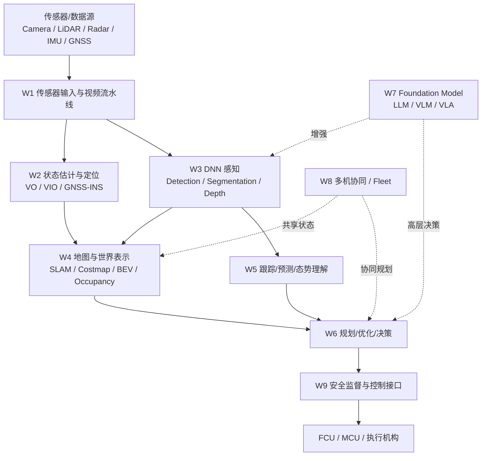
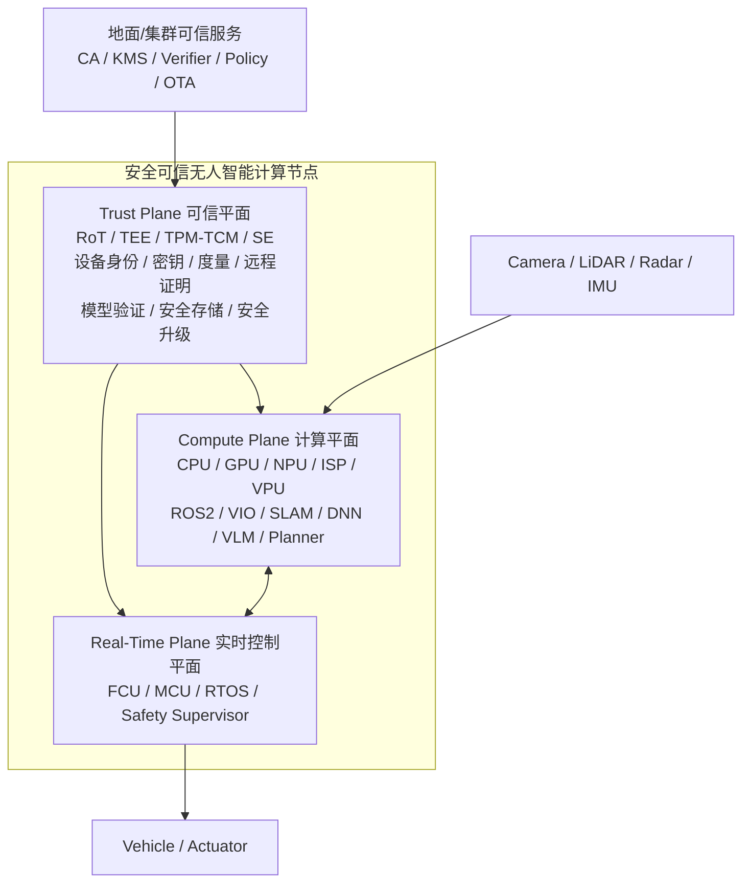
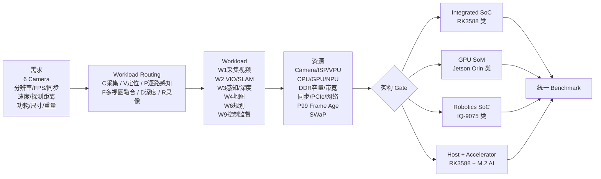

# 面向无人装备的安全可信端侧智能计算平台技术调研与产品化建议

> 版本：v0.3（证据强化版）  
> 日期：2026-09-30  
> 状态：Phase 3 — Final Report Draft  
> 研究仓库：edge-intelligence-research  
> 参考文献索引：[`references/final-report-reference-index-v0.3.md`](../../references/final-report-reference-index-v0.3.md)  
> 说明：本版本重点增强“概念出处—事实依据—工程抽象—结论”的证据链，并补充核心架构图、产品形态总表、六摄像头需求—工作负载—资源—候选架构总表。W1–W9、C1–C5 等编号为本项目研究抽象，不作为行业标准名称使用。

---

# 执行摘要

无人机、无人车、无人船、自主移动机器人等无人装备正在从“远程操控 + 简单自动控制”逐步演化为具备环境感知、状态估计、自主导航、避障、任务规划乃至多模态理解能力的智能系统。这个变化正在重塑端侧计算平台：过去计算节点往往只负责视频编码、简单图像处理或单模型推理，现在则需要同时承担多传感器接入、定位、地图、感知、规划、实时控制协同以及安全可信等多种任务。

这种演进并不是本报告自行设想。PX4 官方文档已经把光流、视觉—惯性里程计（Visual-Inertial Odometry，VIO）和碰撞预防纳入无人机视觉计算链路；Nav2 将移动机器人导航拆分为状态估计、环境表示、规划、控制和行为编排；Autoware 明确给出 Sensing、Map、Localization、Perception、Planning、Control、Vehicle Interface 七个栈；Waymo 对自动驾驶软件的公开描述则归纳为四个核心问题：“我在哪里、周围有什么、接下来会发生什么、我应该做什么”。这些成熟工程框架共同说明：**无人装备智能并不是一个单一模型，而是一条由多种计算任务组成的系统链路。** [R04](https://docs.px4.io/main/en/advanced/computer_vision) [R07](https://docs.nav2.org/rolling/getting_started/navigation_concepts/) [R08](https://docs.autoware.org/main/design/autoware-architecture-v1/) [R10](https://waymo.com/faq/)

因此，本报告不以“哪一种芯片 TOPS 最高”为出发点。TOPS（Tera Operations Per Second，万亿次运算每秒）只能描述某些 AI 运算的理论峰值，无法直接反映摄像头接入、图像处理、VIO/SLAM、路径规划、内存带宽、实时性和热稳定性等系统能力。报告采用如下主线：



图源：[`assets/diagrams/final-report-methodology-evidence-chain-v03.mmd`](../../assets/diagrams/final-report-methodology-evidence-chain-v03.mmd)

在无人装备领域，端侧计算还具有普通机房服务器不具备的安全特点：设备可能长期无人值守、网络不稳定、任务数据敏感，甚至可能被直接获取或拆卸。因此本报告进一步把安全可信作为横向架构，而不是“最后再加一个密码芯片”。远程证明采用 IETF RATS 中 Attester、Verifier、Relying Party 的角色模型；平台固件保护参考 NIST SP 800-193 的“保护—检测—恢复”思路；现实 SoC 也已经出现 Secure Boot、TEE、fTPM、Measured Boot、Rollback Protection 等产品能力。 [R30](https://www.rfc-editor.org/rfc/rfc9334.html) [R31](https://csrc.nist.gov/pubs/sp/800/193/final) [R32](https://docs.nvidia.com/jetson/archives/r36.4.4/DeveloperGuide/SD/Security.html)

本报告最终形成以下主要判断。

**第一，端侧“算力需求”本质上是异构系统资源需求，而不是单一 TOPS 数字。** CPU、GPU、NPU、ISP/VPU、DDR、Camera I/O、实时调度与软件生态共同决定系统能力。

**第二，不能把跨 UAV/UGV/USV/机器人自主能力自行压缩成统一 L1–L5。** NIST ALFUS 本身就是从任务复杂度、环境复杂度、人类参与等多个维度描述无人系统自主能力；道路车辆 SAE J3016 Level 0–5 只面向 On-Road Motor Vehicles；IMO MASS 也采用面向船舶功能和人类监督的 functional approach。 [R01](https://www.nist.gov/publications/framework-autonomy-levels-unmanned-systems-alfus-0) [R02](https://saemobilus.sae.org/topics/electrical-electronics-and-avionics/automation) [R03](https://www.imo.org/en/mediacentre/hottopics/pages/autonomous-shipping.aspx)

**第三，本项目提出 W1–W9 不是创造九级智能，而是把不同领域反复出现的功能模块翻译成“可以做资源预算”的工作负载。** 例如 PX4 VIO、Nav2 State Estimation、Autoware Localization 共同支撑 W2；Autoware Perception、Waymo 和 MLPerf 支撑 W3；Nav2 Planning、Autoware Planning、Waymo “What should I do?” 支撑 W6；PaLM-E、RT-2、OpenVLA 则构成 W7 的事实底座。 [R05](https://docs.px4.io/main/en/computer_vision/visual_inertial_odometry) [R09](https://docs.autoware.org/main/design/autoware-architecture-v1/components/perception/) [R18](https://proceedings.mlr.press/v202/driess23a.html) [R19](https://deepmind.google/blog/rt-2-new-model-translates-vision-and-language-into-action/) [R20](https://openvla.github.io/)

**第四，多摄像头无人平台首先是数据系统，然后才是 AI 系统。** 摄像头数量、分辨率、帧率、格式、同步方式、哪些路进入 VIO、哪些路进入检测、是否采用多视图融合，会决定真实内存流量和模型调用率。

**第五，实时性必须看完整闭环。** 对避障来说，图像采样、ISP、排队、感知、地图、规划、指令传输和机体响应共同决定最终反应距离。PX4 Collision Prevention 本身就明确把传感器距离、速度限制和车辆运动能力联系起来。 [R06](https://docs.px4.io/main/en/computer_vision/collision_prevention)

**第六，现有端侧产品已经形成高集成 SoC/SoM、GPU 机器人计算机、独立 M.2/PCIe AI 加速卡、Host+Accelerator 盒子、工业机器人计算机等不同产品形态。** 它们不能混在一张 TOPS 排名中。Firefly AIBOX PRO 甚至已经直接证明“RK Host + M.2 AI Accelerator”是现实产品形态，而不是理论拼装。 [R37](https://www.t-firefly.com/products/aibox-pro-edge-computing-computer)

**第七，更值得形成的差异化产品方向是“安全可信无人智能计算平台”。** 建议将平台划分为 Compute Plane（计算平面）、Real-Time Plane（实时控制平面）和 Trust Plane（可信平面），把设备身份、启动链、AI 模型、通信、升级、远程证明和物理失陷处置纳入统一架构。

**第八，六摄像头无人平台可以作为上述方法的首个工程 Case。** 现阶段应该优先冻结 FPS、Camera Routing、飞行速度、有效探测距离、VIO/Depth/Detection 路数、功耗和重量边界，再用统一 Benchmark 对 RK3588、Jetson Orin、IQ-9075 和 Host+Accelerator 等候选路线进行验证，而不是先给出“需要 XX TOPS”的结论。

---

# 第一章 调研背景、边界与证据方法

## 1.1 为什么要重新定义“端侧算力调研”

如果调研从产品出发，很容易形成“厂商—芯片—TOPS—价格”的表格，但这种表格回答不了实际工程问题。例如一张 160 TOPS 的 M.2 卡并不能直接接六路摄像头，也不一定负责 VIO、SLAM 和路径规划；而一个只有十几或几十 TOPS 的高度集成 SoC，可能同时具备 ISP、视频编解码、CPU、GPU、NPU 和多种车辆接口，反而更适合某类无人平台。

因此本报告把调研对象从“AI 加速卡”提升为“无人装备端侧智能计算系统”。研究链路是：

> **应用场景 → 功能 → 工作负载 → 资源 → 架构 → 产品 → 验证。**

这也是为什么报告需要大量引用工程栈而不是只引用芯片 Datasheet。

## 1.2 研究边界

本报告覆盖：

- UAV/UAS：无人机和无人航空系统；
- UGV：无人地面车辆、自动驾驶车辆、园区无人车；
- USV：无人水面艇/无人船；
- AMR：自主移动机器人；
- 操作机器人和具身智能；
- 固定式多摄像头边缘智能；
- 多无人平台/Fleet/边云协同。

六摄像头无人平台作为核心 Case Study，但不代表全部行业需求。

## 1.3 自主性为什么不能自创统一 L1–L5

NIST ALFUS 的目标就是建立跨无人系统的自主能力描述框架，但它没有把无人机、无人车、无人船简单压缩成“算力越大等级越高”的一条线，而是关注 Mission Complexity、Environmental Complexity、Human Independence 等维度。 [R01](https://www.nist.gov/publications/framework-autonomy-levels-unmanned-systems-alfus-0)

道路车辆 SAE J3016 当前版本 J3016_202609 仍明确限定于 On-Road Motor Vehicles 的 Dynamic Driving Task，因此它可以用于道路驾驶自动化，却不能直接拿来给 UAV、USV 和机器人分级。 [R02](https://saemobilus.sae.org/topics/electrical-electronics-and-avionics/automation)

IMO 2026 年采用 MASS Code 后仍强调 functional approach，即分析哪些船舶功能由自主系统、远程人员或船上人员承担。 [R03](https://www.imo.org/en/mediacentre/hottopics/pages/autonomous-shipping.aspx)

基于以上依据，本报告不再使用自创的跨领域 L1–L5，而采用：

> **任务场景 + 功能栈 + 自主性画像 + Workload 画像。**

## 1.4 证据分级

报告使用以下证据标签：

- **FACT**：标准、官方规范、可靠公开事实；
- **CASE**：真实产品/系统案例；
- **BENCH**：条件明确的 Benchmark；
- **PAPER**：同行评审论文或高质量综述；
- **SPEC**：官方 Datasheet / Developer Guide；
- **VENDOR**：厂商自述，未独立验证；
- **INFER**：根据事实形成的工程推断；
- **GAP**：证据不足或项目参数未冻结。

这一分级的核心目的，是避免把“厂商说能做”“某个 Demo 跑过”“某个模型 FPS 很高”直接升级成“系统已经满足项目需求”。

## 1.5 Requirement Vector

每个目标平台最终应形成需求向量：

```text
R = {
  Mission,
  Sensors,
  DataRate,
  Synchronization,
  WorkloadSet,
  Concurrency,
  UpdateRate,
  Deadline,
  Memory,
  I/O,
  SWaP-C,
  Safety,
  Security,
  Software,
  Productization
}
```

其中 SWaP-C 是 Size、Weight、Power and Cost，即尺寸、重量、功耗和成本。在无人机上，增加 20 W 计算功耗不仅是电源问题，还会带来散热器、重量和续航变化，因此必须把它视为系统级约束。

---

# 第二章 专业术语与缩略语说明

本章集中给出报告高频术语。正文首次出现的核心术语仍会就地解释。

## 2.1 计算硬件

| 术语 | 中文 | 说明 |
|---|---|---|
| CPU | 中央处理器 | 负责 OS、驱动、ROS、规划、图优化和通用计算；无人系统中很多关键任务并非 NPU 可替代。 |
| GPU | 图形/通用并行处理器 | 可运行 CUDA/OpenCL、视觉、点云、Transformer、VIO 等通用并行计算。 |
| NPU | 神经网络处理器 | 针对张量/神经网络运算优化，能效高，但依赖编译器和算子覆盖。 |
| SoC | 片上系统 | 在一颗芯片内集成 CPU、GPU/NPU、ISP、接口等。 |
| SoM | 系统级模块/核心板 | 在 SoC 基础上集成内存、电源等，便于产品嵌入。 |
| ISP | 图像信号处理器 | 将 Camera RAW 数据转换为可用图像，处理去噪、HDR、3A、颜色等。 |
| VPU | 视频处理单元 | 负责 H.264/H.265 等视频编解码。 |
| DDR/LPDDR | 系统内存 | 多路图像、SLAM、模型和大模型共享的重要资源。 |
| TOPS | 每秒万亿次运算 | AI 峰值算力指标之一，需要明确 INT8/INT4 等精度，不能代表完整系统。 |
| DMA | 直接存储器访问 | 外设直接与内存传输，减少 CPU 搬运。 |
| Zero-copy | 零拷贝 | 多处理阶段共享缓冲区，减少大图像重复复制。 |

## 2.2 无人系统与机器人

| 术语 | 中文 | 说明 |
|---|---|---|
| FCU | 飞行控制单元 | 负责姿态、速度、执行机构和 failsafe 等硬实时控制。 |
| Companion Computer | 伴随/任务计算机 | 与 FCU 配合，运行视觉、SLAM、AI、规划等高层任务。 |
| VO | 视觉里程计 | 由图像估计相机运动。 |
| VIO | 视觉—惯性里程计 | 融合 Camera 与 IMU，估计 3D 位姿和速度。PX4 明确用于 GNSS 不可靠环境。 [R05](https://docs.px4.io/main/en/computer_vision/visual_inertial_odometry) |
| SLAM | 同时定位与建图 | 在未知环境中同时估计自身位置并构建地图。 |
| BEV | 鸟瞰视角表示 | 将多个 Camera/传感器转换到统一俯视空间。BEVFormer 是典型多摄时空 Transformer 实现。 [R17](https://www.ecva.net/papers/eccv_2022/papers_ECCV/html/694_ECCV_2022_paper.php) |
| Occupancy | 占据表示 | 表示三维空间哪些位置被占据，用于自由空间和障碍建模。 |
| Frame Age | 帧龄 | 当前输出对应的原始传感器数据距离现在已有多久。 |
| P95/P99 | 95/99 分位延迟 | 用于描述尾延迟，而不是只看平均值。 |

## 2.3 AI 与大模型

| 术语 | 中文 | 说明 |
|---|---|---|
| DNN | 深度神经网络 | Detection、Segmentation、Depth 等基础 AI 模型。 |
| Transformer | Transformer 架构 | 广泛用于语言、多模态、BEV 和时序融合。 |
| LLM | 大语言模型 | 处理文本理解/生成。 |
| VLM | 视觉语言模型 | 同时理解图像和文本。 |
| VLA | 视觉语言动作模型 | 将视觉和语言进一步映射到机器人动作；RT-2、OpenVLA 为代表。 [R19](https://deepmind.google/blog/rt-2-new-model-translates-vision-and-language-into-action/) [R20](https://openvla.github.io/) |
| KV Cache | 键值缓存 | LLM/VLM 自回归推理中保存历史注意力状态，占用随上下文增加。 |
| TTFT | 首 Token 延迟 | 请求到生成第一个 token 的时间。 |

## 2.4 安全可信

| 术语 | 中文 | 说明 |
|---|---|---|
| RoT | 可信根 | BootROM、eFuse、TPM、SE 等不可轻易被普通软件替换的信任起点。 |
| Secure Boot | 安全启动 | 验证下一启动阶段签名，阻止未经授权代码运行。 |
| Measured Boot | 度量启动 | 对启动组件计算测量值并记录，供后续证明。 |
| TEE | 可信执行环境 | 与普通 OS 隔离的安全执行区域。 |
| TPM/TCM | 可信平台/可信密码模块 | 擅长测量、PCR、sealed key、Quote/Attestation。 |
| SE | 安全元件/安全芯片 | 保护不可导出密钥和提供密码运算。 |
| Remote Attestation | 远程证明 | 远端依据 Evidence 判断设备当前是否处于可信状态；角色定义参考 RFC 9334。 [R30](https://www.rfc-editor.org/rfc/rfc9334.html) |
| Anti-Rollback | 防回滚 | 防止系统退回有漏洞旧版本。 |
| OTA | 空中升级 | 网络远程更新固件、应用或模型。 |

---

# 第三章 行业功能栈依据：W1–W9 从哪里来

## 3.1 先说明：W1–W9 是研究抽象，不是行业标准

这是本报告需要特别说明的一点。

目前没有一个标准直接规定“无人端侧计算应分成 W1–W9 九类”。W1–W9 是本项目为了统一分析 UAV、UGV、USV、AMR、机器人和固定边缘设备而建立的**工作负载分类（Workload Taxonomy）**。

它的建立过程不是从九个编号出发，而是先比较成熟系统和论文中反复出现的功能：

- PX4：Optical Flow、VIO、Collision Prevention，且高级视觉通常运行在 Companion Computer； [R04](https://docs.px4.io/main/en/advanced/computer_vision)
- Nav2：State Estimation、Environmental Representation、Planner、Controller、Behavior； [R07](https://docs.nav2.org/rolling/getting_started/navigation_concepts/)
- Autoware：Sensing、Map、Localization、Perception、Planning、Control、Vehicle Interface； [R08](https://docs.autoware.org/main/design/autoware-architecture-v1/)
- Waymo：Where am I? / What’s around me? / What will happen next? / What should I do?； [R10](https://waymo.com/faq/)
- GNSS-denied UAV 综述：VIO、SLAM、INS、视觉、LiDAR、传感器融合； [R11](https://link.springer.com/article/10.1186/s43020-025-00162-z)
- 多机器人综述：Perception、Planning、Collaboration； [R12](https://www.sciencedirect.com/science/article/pii/S2667379724000615)
- Foundation Model / VLA：PaLM-E、RT-2、OpenVLA。 [R18](https://proceedings.mlr.press/v202/driess23a.html) [R19](https://deepmind.google/blog/rt-2-new-model-translates-vision-and-language-into-action/) [R20](https://openvla.github.io/)

然后将这些功能进一步转换为对硬件有相似资源特征的 workload。

## 3.2 来源映射

| 本项目分类 | 主要出处依据 | 为什么独立成一类 workload |
|---|---|---|
| W1 Sensor I/O / Video | PX4、Autoware Sensing、Isaac ROS、现有 Camera/ISP SoC [R04][R08][R22] | 数据吞吐、ISP/VPU、Camera、DDR 是独立瓶颈，不属于纯 AI 推理 |
| W2 State Estimation / Localization | PX4 VIO、Nav2 State Estimation、Autoware Localization、UAV综述 [R05][R07][R08][R11] | 主要依赖 CPU/GPU、同步和低延迟，不宜被 NPU TOPS 吞并 |
| W3 DNN Perception | Autoware Perception、Waymo、Isaac ROS、MLPerf [R09][R10][R22][R25] | 典型 NPU/GPU 张量工作负载 |
| W4 Mapping / World Representation | Nav2 Costmap、Autoware Occupancy、BEVFormer、Isaac ROS mapping [R07][R09][R17][R22] | 需要持续维护地图/空间状态，内存与带宽特征明显 |
| W5 Prediction / Tracking / Situation | Waymo “What will happen next”、BEV 时序、多机器人综述 [R10][R17][R12] | 依赖历史状态、跟踪和时序模型 |
| W6 Planning / Optimization / Decision | Nav2、Autoware、Waymo、USV综述 [R07][R08][R10][R13] | 常由 CPU/优化器承担，关注 worst-case latency |
| W7 Foundation Model / VLM / VLA | PaLM-E、RT-2、OpenVLA、VLA综述 [R18][R19][R20][R21] | 大内存、多精度、TTFT/生成时延，与传统 CV 资源结构不同 |
| W8 Multi-Agent / Fleet | Multi-robot survey、MiR Fleet [R12][R15] | 新增网络、分布式状态和任务分配 |
| W9 Safety / Control Supervision | PX4、Nav2 Control、Autoware Control、MASS、MiR Safety [R03][R06][R07][R08][R15] | 算力不一定大，但强调确定性和安全隔离 |

因此，**编号是本项目的，功能事实和工程依据来自行业已有体系。**

---

# 第四章 W1–W9 工作负载详述



图源：[`assets/diagrams/final-report-workload-map-v03.mmd`](../../assets/diagrams/final-report-workload-map-v03.mmd)

## 4.1 W1：传感器输入与视频流水线

W1 对应 Sensing/Data Acquisition。在 Autoware 中 Sensing 是独立栈；PX4 视觉能力的上游也是 Camera/距离等传感器；现代机器人 SoC 还会直接集成 ISP、Video Codec 和 Camera Interface。 [R04](https://docs.px4.io/main/en/advanced/computer_vision) [R08](https://docs.autoware.org/main/design/autoware-architecture-v1/)

W1 包括 Camera capture、ISP、Demosaic、HDR、去噪、缩放、颜色转换、视频编码、时间戳、同步和 DMA。它的典型资源不是 NPU，而是 Camera PHY/SerDes、ISP、VPU、DDR 和数据搬运。

这也是为什么多摄像头平台应先问“能否稳定接入、同步、处理和搬运”，而不是先问“AI TOPS 是否足够”。

## 4.2 W2：状态估计与定位

PX4 对 VIO 的官方定义是：利用 Visual Odometry 与 IMU 组合估计载体的 3D pose、orientation 和 velocity，常用于 GPS 不存在或不可靠的环境。 [R05](https://docs.px4.io/main/en/computer_vision/visual_inertial_odometry)

Nav2 把 State Estimation 明确作为导航基本概念，包含 localization、odometry 和 sensor fusion；Autoware 同样将 Localization 作为独立栈。 [R07](https://docs.nav2.org/rolling/getting_started/navigation_concepts/) [R08](https://docs.autoware.org/main/design/autoware-architecture-v1/)

因此 W2 并不是“为了凑一个分类”。它代表一类算法结构与 DNN 明显不同的工作负载：特征处理、滤波、非线性优化、图优化和时间同步通常大量依赖 CPU，也可能使用 GPU，但不能用 NPU TOPS 直接替代。

## 4.3 W3：DNN 感知

Autoware Perception 不仅包括 Object Recognition，还包含 Obstacle Segmentation、Traffic Light、Occupancy 等语义环境理解。 [R09](https://docs.autoware.org/main/design/autoware-architecture-v1/components/perception/)

W3 主要包括 Detection、Classification、Segmentation、Depth、Pose、Free-space 等深度学习任务。它通常是 NPU/GPU 最擅长的部分。

但实际性能取决于模型、输入、precision、算子覆盖、编译器、前处理、后处理和并发流。MLPerf 等 Benchmark 的意义就在于尽量统一这些测试条件，而不是只比较芯片理论 TOPS。 [R25](https://mlcommons.org/benchmarks/inference-datacenter/)

## 4.4 W4：地图与世界表示

Nav2 用 costmap/environment representation 维持机器人周围环境；Autoware Perception 会生成 Occupancy 等信息；BEVFormer 则通过多摄像头空间 cross-attention 与 temporal attention 构建统一 Bird's-Eye-View 表示。 [R07](https://docs.nav2.org/rolling/getting_started/navigation_concepts/) [R09](https://docs.autoware.org/main/design/autoware-architecture-v1/components/perception/) [R17](https://www.ecva.net/papers/eccv_2022/papers_ECCV/html/694_ECCV_2022_paper.php)

因此 W4 的资源特征包括长期状态、地图缓存、点云/空间表示以及较大的内存访问量。它与“单帧跑一次检测”完全不同。

## 4.5 W5：跟踪、预测与态势理解

Waymo 对软件能力的第三个问题是“What will happen next?”，这正对应跟踪与预测。 [R10](https://waymo.com/faq/)

一个系统仅在每帧检测到车辆，并不能直接预测它下一秒的运动。W5 需要维护历史轨迹、对象状态和交互信息，高级方案可能使用时序 Transformer。

W5 是从“看见对象”到“理解动态环境”的桥梁。

## 4.6 W6：规划、优化与决策

Nav2 的 planner、controller、behavior tree，Autoware 的 Planning，以及 Waymo 的“What should I do?”共同证明规划/决策是自主系统中的独立模块。 [R07](https://docs.nav2.org/rolling/getting_started/navigation_concepts/) [R08](https://docs.autoware.org/main/design/autoware-architecture-v1/) [R10](https://waymo.com/faq/)

W6 包括 A*、Dijkstra、RRT、轨迹优化、MPC、Behavior Planning 等。它可能主要消耗 CPU，也可能使用 GPU/NPU 的 learned planning。

这类 workload 的关键指标常常是 worst-case latency，而不是 TOPS。

## 4.7 W7：Foundation Model / VLM / LLM / VLA

PaLM-E 将视觉、连续状态和语言输入引入 embodied language model；RT-2 进一步把 VLM 转换为 VLA，输出机器人动作；OpenVLA 则公开了 7B VLA 和 970k robot demonstrations 的训练数据规模。 [R18](https://proceedings.mlr.press/v202/driess23a.html) [R19](https://deepmind.google/blog/rt-2-new-model-translates-vision-and-language-into-action/) [R20](https://openvla.github.io/)

这些材料证明 VLM/VLA 是实际研究路线，而不是概念炒作。但 VLA efficiency 综述同样指出 massive computational demand、memory demand、real-time requirement 与 onboard constraints 之间存在明显矛盾。 [R21](https://arxiv.org/abs/2510.17111)

因此 W7 必须单独分析模型权重、内存、KV Cache、TTFT、token/action latency 和资源隔离。

## 4.8 W8：多机协同与 Fleet

多机器人综述把 Perception、Planning、Collaboration 作为主线；现实工业产品 MiR Fleet 也承担任务规划和交通控制。 [R12](https://www.sciencedirect.com/science/article/pii/S2667379724000615) [R15](https://mobile-industrial-robots.com/)

这意味着当系统从单机走向 Fleet 时，新瓶颈会包括网络 QoS、共享状态、任务分配、协同感知和可信身份。

## 4.9 W9：安全监督与控制

W9 包括 Flight/Motion Control、Safety Supervisor、Health Monitoring、Failsafe 和实时车辆接口。

MiR250 公开有符合 ISO 13849-1 的安全功能；PX4 Collision Prevention 直接限制车辆速度以防碰撞；IMO MASS Code 也强调安全、连接、远程运营和人类监督。 [R15](https://mobile-industrial-robots.com/products/robots/mir250/specifications) [R06](https://docs.px4.io/main/en/computer_vision/collision_prevention) [R03](https://www.imo.org/en/mediacentre/hottopics/pages/autonomous-shipping.aspx)

W9 的特点是“计算量不一定大，但必须按时完成”。这也是为什么需要把实时控制和 AI 吞吐分开分析。

---

# 第五章 Workload Composition：从单任务到现实系统

C1–C5 同样不是行业等级，而是本项目为了复用系统预算建立的组合 ID。

## 5.1 C1 Multi-Camera Analytics

```text
W1 + W3 + W5
(+ W7 按需)
```

现实对应固定多摄像头视觉分析、工业视觉和智能视频节点。这类系统没有本体定位/控制，因此 Host+Accelerator 往往容易发挥作用。

## 5.2 C2 Visual Autonomy

```text
W1 + W2 + W3 + W4 + W6 + W9
```

现实对应 GNSS 拒止 UAV、视觉导航 AMR、多摄像头自主机器人。PX4 VIO、Nav2、Isaac ROS 多摄 VSLAM/Depth/Mapping 都为这种组合提供了工程依据。 [R05](https://docs.px4.io/main/en/computer_vision/visual_inertial_odometry) [R07](https://docs.nav2.org/rolling/getting_started/navigation_concepts/) [R24](https://nvidia-isaac-ros.github.io/v/release-3.2/performance/index.html)

## 5.3 C3 Multi-Sensor Autonomy

```text
W1 + W2 + W3 + W4 + W5 + W6 + W9
```

典型为自动驾驶、Radar/Camera/LiDAR 融合 UGV、复杂 USV。Waymo 的 Camera+LiDAR+Radar 和四问分解是现实例证。 [R10](https://waymo.com/faq/)

## 5.4 C4 Foundation-Model Augmented Robotics

```text
Base Autonomy + W7
```

VLM/VLA 是对底层 autonomy 的增量，而不是替代 W2/W6/W9 的安全闭环。

## 5.5 C5 Cooperative Autonomy

在单机 C2/C3 基础上叠加 W8，形成多机协同、Fleet 和共享感知。

---

# 第六章 从 Workload 推导计算与系统资源

## 6.1 先算数据，再算 AI

对 Camera：

```text
PixelRate = Σ(N × Width × Height × FPS)
```

但同样的像素率可能对应不同 RAW/NV12/RGB 字节量；而且 ISP、resize、DNN、codec、recording 可能反复读写同一帧。

所以真实 DDR traffic 不能只用 Sensor payload 代替。

## 6.2 Camera Routing Set

本报告使用：

```text
C = physical capture cameras
V = VIO/SLAM camera subset
P = PER_VIEW perception subset
F = FUSED_MULTI_VIEW camera subset
D = depth/stereo subset
R = recording subset
```

这是一个分析记号，不是行业标准。它解决的是一个非常实际的问题：六路物理 Camera 不等于六路都进入同一算法。

## 6.3 PER_VIEW 与 FUSED_MULTI_VIEW

PER_VIEW 表示每路独立跑模型：

```text
InferenceRate = N_detection × detection_hz
```

FUSED_MULTI_VIEW 表示一次 model call 读取多视角：

```text
ModelCallRate = perception_update_hz
InputViewRate = N_views_per_call × perception_update_hz
```

BEVFormer 就是现实多视图时空融合模型的典型例子。 [R17](https://www.ecva.net/papers/eccv_2022/papers_ECCV/html/694_ECCV_2022_paper.php)

## 6.4 CPU、GPU、NPU 各自为什么重要

CPU 负责 ROS、驱动、图优化、tracking、planning、network/storage，是自主系统的通用控制与算法引擎。

GPU 具有高并行和可编程性，适合 VSLAM、Depth、Point Cloud、BEV、Transformer 和多种自定义 kernel。Isaac ROS 同时覆盖 perception、Visual SLAM、Depth、Mapping，就是 GPU 通用并行能力的现实体现。 [R22](https://developer.nvidia.com/isaac/ros)

NPU/AI ASIC 适合 DNN tensor 运算，但算子和 compiler 决定真实可用性。独立 accelerator 更不能替代 Host 的 Camera、VIO 和 planning。

## 6.5 Memory/DDR

运行内存需要容纳：

```text
OS
+ Runtime
+ Weights
+ Activation/Workspace
+ Camera Buffers
+ VIO/SLAM State
+ Map
+ Queues
+ KV Cache
+ Margin
```

对于 W7，大模型是否“装得下”常比峰值 TOPS 更早成为硬约束。

## 6.6 闭环时延

```text
T_reaction =
T_sample
+ T_sensor/ISP
+ T_queue
+ T_perception
+ T_fusion/map
+ T_planner
+ T_command
+ T_vehicle_response
```

```text
D_reaction = speed × T_reaction
```

PX4 Collision Prevention 会根据障碍信息和车辆运动约束限制速度，本质上说明传感器范围、时延与动力学必须联合分析。 [R06](https://docs.px4.io/main/en/computer_vision/collision_prevention)

例如 10 m/s 飞行、200 ms 完整反应时间，对应约 2 m 的前进距离。因此“模型 20 ms”不能直接等于“系统反应 20 ms”。

## 6.7 P95/P99 与 Frame Age

平均 latency 很容易掩盖资源争抢造成的偶发长尾。对避障更有意义的是 P99 Frame Age：99% 情况下，当前控制决策所依据的传感器信息有多“旧”。

这也是后续 Benchmark 必须从单模型 FPS 升级到系统 E2E 的原因。

---

# 第七章 端侧计算技术路线与产品形态

## 7.1 产品形态总表

原始机器可读数据：[`data/product-specs/final-report-product-form-comparison-v03.csv`](../../data/product-specs/final-report-product-form-comparison-v03.csv)

| 产品形态 | 典型代表 | 核心优势 | 主要限制 | 更适合的任务 |
|---|---|---|---|---|
| Integrated SoC/SoM | RK3588、IQ-9075、Atlas 200I A2、BM1688 | Camera/ISP/CPU/NPU 集成，数据路径短，SWaP 较好 | 共用 DDR、软件栈绑定、具体 SKU 接口差异 | C1、C2，部分 C3 |
| GPU Robotics SoM/Computer | Jetson Orin、reComputer Robotics | GPU 通用性强，VSLAM/Depth/Transformer/ROS 生态成熟 [R22][R23] | 功耗、散热、成本、重量 | C2、C3、C4 |
| Independent AI Accelerator | LQ50、Metis、Hailo-10H | 高 DNN 能效、模块化扩展 | 仍依赖 Host；PCIe 搬运；卡功耗≠系统功耗 | W3、部分 W7 |
| Host + Accelerator Box | Firefly AIBOX PRO | Host+加速卡已产品化；可换档位 [R37] | E2E 时延和散热需按整机验证 | C1；C2 需验证；C4 |
| RT Controller + Companion | PX4 FCU + Companion | AI/Linux 与硬实时控制隔离 [R04][R05] | 系统集成复杂、域间通信需设计 | C2、C3 |
| Rugged Robotics Computer | Seeed、Advantech | GMSL/CAN/宽压/工业结构完整 [R43][R44] | 通常偏重，不适小型 UAV | UGV、USV、AMR |
| Edge Server / Edge-Cloud | GPU/x86 Edge Server | 大内存、大模型、多机全局计算 | 网络依赖，不可替代本地安全闭环 | C4、C5、离线任务 |

## 7.2 Integrated SoC / SoM

这类平台将 CPU、GPU/NPU、ISP、VPU 和 I/O 集成到同一 SoC 或核心板上。

Qualcomm IQ-9075 官方面向 Robotics/AMR/Drone，并公开多 Camera、内存和实时子系统能力；Atlas 200I A2 官方也明确面向机器人/无人机；BM1688 Core/AIO 公开有 6-channel sensor input。 [R36](https://www.qualcomm.com/internet-of-things/products/iq9-series/iq-9075) [R41](https://www.hiascend.com/zh/hardware/accelerator-module-A2) [R42](https://www.t-firefly.com/products/core-1688jd4-core-board)

其价值是数据不必跨 PCIe 来回搬运，但仍必须验证共享 DDR 和多 workload 并发。

## 7.3 GPU Robotics Platform

Jetson 的价值不只是 275 TOPS，而是 CUDA、TensorRT、Isaac ROS 和 VSLAM/Depth/Mapping 的系统生态。Isaac ROS 5.0 提供固定版本性能页，Nova Carter 3.2 还提供物理多 Camera VSLAM/Depth/Mapping Live Graph。 [R23](https://nvidia-isaac-ros.github.io/v/release-5.0/performance/index.html) [R24](https://nvidia-isaac-ros.github.io/v/release-3.2/performance/index.html)

这类路线适合复杂 C2/C3/C4，但小型 UAV 需要重点评估功耗和重量。

## 7.4 Independent Accelerator 与 Host+Accelerator

Houmo LQ50、Axelera Metis、Hailo-10H 是典型 M.2/PCIe accelerator。 [R38](https://developer.houmoai.com/hmdoc/m50/hardware-manuals/latest/product-manuals/lq50-m.2/LQ50_M.2_guidelines/intro/index.html) [R39](https://docs.axelera.ai/docs/hardware/getting-started/start/embedded-113m/) [R40](https://hailo.ai/zh-hans/products/ai-accelerators/hailo-10h-m-2-generative-ai-acceleration-module/)

Firefly AIBOX PRO 进一步说明 RK3588/RK3576 Host + 双 M.2 accelerator slot 已成为完整产品。 [R37](https://www.t-firefly.com/products/aibox-pro-edge-computing-computer)

但这一形态必须把 Host 作为一等变量：Camera/ISP、VIO、planning、预处理和系统调度仍然由 Host 负责。

## 7.5 Real-Time Controller + Companion Computer

PX4 VIO 示例使用 Tracking Camera + Companion Computer + ROS 向 PX4 提供 odometry，这本身就是典型的“实时飞控 + 高层计算机”结构。 [R05](https://docs.px4.io/main/en/computer_vision/visual_inertial_odometry)

这类架构的核心不是性能，而是故障隔离：Linux/AI 侧偶发抖动不能直接破坏姿态控制。

---

# 第八章 安全可信型无人装备端侧智能计算平台

## 8.1 为什么不是“加一颗密码芯片”

无人装备可能离开受控场所，存在物理捕获、恶意升级、模型篡改、非法节点接入和任务数据泄漏等风险。

PX4 当前已经把 Security 作为独立生产主题；ROS 2/DDS 具有身份、访问控制和加密机制；NIST SP 800-193 则要求平台具备保护、检测、恢复能力。 [R29](https://docs.px4.io/main/en/security/) [R28](https://docs.ros.org/en/rolling/Concepts/Intermediate/About-Security.html) [R31](https://csrc.nist.gov/pubs/sp/800/193/final)

因此“安全可信”应当是系统架构，而不是一个外挂器件。

## 8.2 三平面架构



图源：[`assets/diagrams/secure-trusted-three-plane-v03.mmd`](../../assets/diagrams/secure-trusted-three-plane-v03.mmd)

Compute Plane 解决“算什么”；Real-Time Plane 解决“什么时候必须算完”；Trust Plane 解决“为什么可以相信设备、软件、模型和通信”。

## 8.3 Secure Boot 与 Measured Boot

Secure Boot 验证下一阶段代码签名，阻止未授权软件启动。Measured Boot 则记录启动组件 hash，为远程证明提供状态 Evidence。

NVIDIA 当前 Jetson fTPM 文档直接区分这两条链：Secure Boot 建立授权启动链；Measured Boot 把 bootloader、firmware、kernel 等测量到 PCR。 [R33](https://docs.nvidia.com/jetson/archives/r39.2.1/DeveloperGuide/SD/Security/FirmwareTPM/BootFlow.html)

因此报告不能把“支持 Secure Boot”直接写成“支持 Remote Attestation”。

## 8.4 TEE、TPM/TCM 与商密 SE

TEE 适合将 key wrapping、签名、attestation agent 等敏感服务隔离于普通 Linux。Jetson 的 OP-TEE 公开说明 Secure World 与 Normal World 分离。 [R32](https://docs.nvidia.com/jetson/archives/r36.4.4/DeveloperGuide/SD/Security.html)

TPM/TCM 更擅长度量、PCR、sealed key、Quote；商密安全芯片更适合不可导出 SM2 私钥、SM3/SM4、TRNG 和设备身份。

三个技术可以组合，但不能互相等同。

## 8.5 Remote Attestation

RFC 9334 的标准角色是：

```text
Attester
  │ Evidence
  ▼
Verifier
  │ Attestation Result
  ▼
Relying Party
```

[R30](https://www.rfc-editor.org/rfc/rfc9334.html)

将其映射到无人系统，可以设计为：

- 无人装备 = Attester；
- 地面可信验证服务 = Verifier；
- Fleet Controller/任务系统 = Relying Party。

进一步可把 mission key、model key、network credential 的释放绑定到 Attestation Result。

## 8.6 AI Artifact Trust

AI 系统中影响任务行为的不只有 firmware，还包括：

```text
Model Weight
+ Manifest
+ Runtime Version
+ Config
+ Threshold
+ Pre/Post
+ Planner Parameters
```

因此安全可信平台应把模型包签名、hash、版本、授权和 rollback policy 纳入统一生命周期。

---

# 第九章 六摄像头无人平台：需求 → Workload → 资源 → 候选架构

## 9.1 总体逻辑图



图源：[`assets/diagrams/six-camera-requirement-resource-architecture-v03.mmd`](../../assets/diagrams/six-camera-requirement-resource-architecture-v03.mmd)

## 9.2 核心总表

原始数据：[`data/calculations/six-camera-requirement-workload-resource-architecture-v03.csv`](../../data/calculations/six-camera-requirement-workload-resource-architecture-v03.csv)

| 需求/变量 | 当前状态 | Workload | 主要资源影响 | 架构影响 |
|---|---|---|---|---|
| N_capture = 6 | 已确认 | W1 | Camera lane、ISP、buffer、DDR | 所有候选都必须证明六路接入路径 |
| 1072×1280 NV12 | 单路已观测 | W1 | image-plane 数据量、copy、DDR | 只能做敏感性分析，不能反推 RAW/MIPI |
| actual FPS | GAP | W1/W2/W3 | Pixel Rate、模型调用率、时延 | 阻塞定量平台 sizing |
| 六路 mode 一致性 | GAP | W1 | Camera 带宽与 ISP 调度 | 阻塞 exact lane/ISP budget |
| multi-camera sync | 已确认需求方向 | W1/W2/W4 | timestamp、VIO/Depth/Fusion 正确性 | 平台必须提供可靠同步机制 |
| N_detection / topology | GAP | W3/W5 | NPU/GPU service demand、DDR | 决定一体 NPU 是否足够、是否需要 accelerator |
| N_vio | GAP | W2 | CPU/GPU、Camera+IMU sync、tail latency | Host 能力成为关键 |
| N_depth | GAP | W3/W4 | GPU/NPU、buffer、DDR | 可能更偏 GPU/robotics SoC |
| N_record | GAP | W1 | VPU、存储、DDR | 影响 codec Gate |
| flight speed | GAP | W6/W9 | reaction-distance deadline | 决定最大 P99 Frame Age |
| detection range / keep-out | GAP | W3/W6/W9 | latency margin、传感器/模型要求 | 决定避障可行性 |
| vehicle response | GAP | W9 | 完整闭环时间 | 必须进入 FCU/动力学预算 |
| 功耗/尺寸/重量 | GAP | 全部 | thermal、续航、降频 | 决定小型 UAV 与工业整机边界 |
| VLM | 可选 | W7 | 大内存、TTFT、隔离 | 增量能力，不进入基础避障闭环 |
| Trust Plane | 产品方向 | 横向 | RoT、Boot、Key、Attestation、OTA | 形成跨计算 SKU 的差异化 |

## 9.3 已观测图像数据量

当前仅确认单路 downstream 为 1072×1280 NV12。以 NV12 约 1.5 Byte/pixel 做敏感性计算：

| FPS | 六路 Pixel Rate | 一份 NV12 Image-Plane Payload |
|---:|---:|---:|
| 10 | 82.33 MP/s | 123.49 MB/s |
| 20 | 164.66 MP/s | 246.99 MB/s |
| 30 | 246.99 MP/s | 370.48 MB/s |
| 60 | 493.98 MP/s | 740.97 MB/s |
| 120 | 987.96 MP/s | 1481.93 MB/s |

这些数值不是 DDR 实测。若 ISP 写一次、resize 读写、DNN 再读、codec 再读，实际 working traffic 会更高。

因此六摄项目的第一步不是选 50/100/160 TOPS，而是冻结实际 FPS、Camera Routing 和数据路径。

## 9.4 Candidate 1：RK3588 Integrated SoC

逻辑：

```text
6 Camera → ISP/VPU → shared DDR
                 → NPU (W3)
                 → CPU/GPU (W2/W4/W6)
                 → FCU
```

优势是高集成、国内生态和较短数据路径。

关键 GAP：六路 exact ingest、VIO+Detection 并发、DDR、P99、热稳态。

## 9.5 Candidate 2：Jetson Orin

Jetson 的公开优势来自完整机器人软件和 GPU workload，而不只是 TOPS。Isaac ROS 已有多摄 VSLAM/Depth/Mapping Live Graph 事实。 [R24](https://nvidia-isaac-ros.github.io/v/release-3.2/performance/index.html)

关键需要验证本项目 exact 六摄模式、功耗、重量和统一 YOLO/VIO/Depth/Planner 并发。

## 9.6 Candidate 3：IQ-9075

IQ-9075 官方面向 Robotics/AMR/Drone，具有高集成异构架构和 RT subsystem。 [R36](https://www.qualcomm.com/internet-of-things/products/iq9-series/iq-9075)

关键 GAP：物理六摄同构、VIO numeric latency、项目供应链和软件成熟度。

## 9.7 Candidate 4：RK3588 Host + Accelerator

结构：

```text
RK3588：
W1 Camera/ISP
W2 VIO
W4 Map
W6 Planning

M.2 Accelerator：
W3 Detection/Depth
可选 W7
```

Firefly AIBOX PRO 说明这种架构已经有完整产品。 [R37](https://www.t-firefly.com/products/aibox-pro-edge-computing-computer)

但是否优于一体 SoC，必须通过 Host↔Accelerator 的 H2D/D2H、PCIe、pre/post、E2E P99 和总功耗验证。

---

# 第十章 Benchmark 与工程验证体系

## 10.1 为什么公开规格还不够

产品 Datasheet 能告诉我们 TOPS、内存和接口，但不能回答多个 workload 并发后的 P99。

NVIDIA Isaac ROS 固定版本 Benchmark 的价值在于提供明确的软件版本和 graph/component timing；Nova Carter Live Graph 更进一步进入物理多 Camera 系统级路径。 [R23](https://nvidia-isaac-ros.github.io/v/release-5.0/performance/index.html) [R24](https://nvidia-isaac-ros.github.io/v/release-3.2/performance/index.html)

因此后续必须把“资料调研”转换为可复现 Benchmark。

## 10.2 W1：Camera / Video

测：
- 多 Camera 同时采集；
- timestamp jitter；
- dropped frame；
- ISP；
- encode；
- DDR；
- zero-copy。

## 10.3 W2：VIO / SLAM

推荐 EuRoC 和 TUM VI。 [R26](https://projects.asl.ethz.ch/datasets/doku.php?id=kmavvisualinertialdatasets) [R27](https://cvg.cit.tum.de/data/datasets/visual-inertial-dataset)

记录：
- ATE/RPE；
- CPU/GPU；
- latency；
- failure/recovery。

## 10.4 W3：DNN

统一模型、输入、precision、batch 和前后处理，不能拿不同模型 FPS 直接排序。

## 10.5 Full C2

真正关键的是：

```text
6 Camera
+ VIO
+ Detection
+ Depth
+ Local Map
+ Planner
+ FCU Interface
```

记录 P50/P95/P99、Frame Age、deadline miss、DDR、power、temperature。

## 10.6 Thermal

持续 30 min / 1 h / 2 h，观察：
- clock；
- temperature；
- throttling；
- sustained FPS；
- P99 是否漂移。

## 10.7 Trust Benchmark

验证：
- 未签名 boot image 是否被阻断；
- model tamper 是否被发现；
- rollback 是否被阻断；
- key 是否不可导出；
- attestation 是否能识别异常状态；
- 未授权 ROS/MAVLink 节点是否被拒绝；
- capture/revoke 流程是否有效。

---

# 第十一章 技术发展趋势

## 11.1 从单帧 Detection 到时空多视图世界表示

BEVFormer 的多摄空间 cross-attention 和 temporal attention 表明，感知已经从“每帧框几个目标”向多视角、时序、空间统一表示发展。 [R17](https://www.ecva.net/papers/eccv_2022/papers_ECCV/html/694_ECCV_2022_paper.php)

这会提高 DDR、temporal cache、Transformer 和多 Camera 同步需求。

## 11.2 模块化与 E2E 会长期并存

Autoware 的模块化架构已经成熟，同时行业也在探索 E2E/learned planning。工程上更合理的判断是：短中期内“确定性安全骨架 + 学习增强”会长期共存，而不是所有模块一次被大模型替代。

## 11.3 VLM/VLA 会进入端侧，但不是所有无人机默认需求

PaLM-E、RT-2、OpenVLA 证明了 embodied foundation model 的路线。 [R18](https://proceedings.mlr.press/v202/driess23a.html) [R19](https://deepmind.google/blog/rt-2-new-model-translates-vision-and-language-into-action/) [R20](https://openvla.github.io/)

但大模型的 memory/latency/onboard constraints 同样已经被综述明确指出。 [R21](https://arxiv.org/abs/2510.17111)

因此 VLM/VLA 更适合作为可选 C4 增量，而不是基础 C2 的默认配置。

## 11.4 Edge-Cloud 不是替代本机，而是分层

Edge Robotics 综述强调低时延、本地处理的价值，同时指出网络波动和 task offloading 的现实问题。 [R14](https://doi.org/10.3390/jsan14040065)

因此：
- safety / hard real-time 必须本地；
- mission-critical perception 优先本地；
- global optimization / large model 可近边缘；
- training / fleet knowledge 可云端。

## 11.5 Fleet 将把 Trust 变成平台一级能力

多机器人协同后，设备身份和 software posture 会直接影响共享感知、任务分配和网络准入。Remote Attestation 的 Attester/Verifier/Relying Party 模型与 Fleet 系统天然可以结合。 [R30](https://www.rfc-editor.org/rfc/rfc9334.html)

---

# 第十二章 产品研发建议

## 12.1 产品定位

不建议将后续产品定义为：

> “国产 XX TOPS AI 算力盒”。

更建议定义为：

> **面向无人装备的安全可信端侧智能计算平台。**

竞争点不是单一峰值算力，而是：

> **多传感器接入 + 异构计算 + 实时控制协同 + 密码安全 + 平台可信 + 生命周期管理。**

## 12.2 三平面产品体系

### Compute Plane
负责 W1–W8 的主要智能计算，包括 Camera、ISP、CPU/GPU/NPU、ROS2、VIO、SLAM、DNN、VLM 和 Planner。

### Real-Time Plane
负责 FCU/MCU、实时控制、Safety Supervisor 和 Failsafe。

### Trust Plane
负责 RoT、设备身份、SM2/SM3/SM4、Secure/Measured Boot、Key、Attestation、Model Trust、Communication Security、OTA 和 Capture Response。

## 12.3 Trust Service API

建议把底层 TEE、TPM/TCM、SE 统一抽象：

```text
/device/identity
/crypto/sign
/crypto/encrypt
/key/unseal
/model/verify
/platform/measure
/platform/attest
/update/verify
/security/event
```

这与 Arm PSA 把 Crypto、Secure Storage、Attestation、Firmware Update 抽象成服务的思路相似。 [R34](https://www.arm.com/architecture/security-features/platform-security)

## 12.4 产品系列

### 轻量 UAV Node
Integrated SoC 优先，多 Camera、独立 FCU、低 SWaP、基础 Trust Plane。

### 高性能 Robotics Node
更大内存、GPU/NPU、多 Sensor、高速网络、完整 Trust Plane、可选 C4。

### Host+Accelerator Expansion
统一 Host + 可替换 M.2/PCIe accelerator，为 W3/W7 扩展算力。

### Fleet Trust Service
CA/KMS、Verifier、Policy、Revocation、OTA、Device Inventory。

## 12.5 六摄项目近期优先冻结

1. actual Camera FPS；
2. 六路 mode；
3. N_detection / topology；
4. N_vio；
5. N_depth；
6. N_record；
7. 飞行速度；
8. usable detection range；
9. keep-out / vehicle response；
10. 功耗、尺寸和重量边界。

这些参数一旦明确，就可以由本报告的方法真正生成产品规格，而不是从某个芯片 TOPS 倒推。

---

# 结论

本次调研的主要价值不是罗列“谁有多少 TOPS”，而是建立了一条有外部材料支撑的工程分析链。

在行业事实层，PX4、Nav2、Autoware、Waymo、NIST ALFUS、IMO MASS，以及 UAV/USV/多机器人综述共同说明：无人系统的自主能力由传感器、定位、感知、地图、预测、规划、控制和协同等多个功能构成，而不是一个神经网络。 [R01](https://www.nist.gov/publications/framework-autonomy-levels-unmanned-systems-alfus-0) [R04](https://docs.px4.io/main/en/advanced/computer_vision) [R07](https://docs.nav2.org/rolling/getting_started/navigation_concepts/) [R08](https://docs.autoware.org/main/design/autoware-architecture-v1/) [R10](https://waymo.com/faq/)

在研究抽象层，本项目将这些跨领域功能进一步整理为 W1–W9 workload taxonomy，再用 C1–C5 描述典型组合。**这些编号本身属于本项目研究方法，但其内部每一类工作负载都有明确的行业原型和文献来源。**

在架构层，本报告进一步把 workload 转换为 CPU/GPU/NPU、内存、ISP/VPU、I/O、实时性和 SWaP 等资源，再用 Architecture Gate 筛选 Integrated SoC、GPU SoM、Host+Accelerator 和工业整机等不同产品形态。

在产品方向上，通用 AI Box 已有较成熟市场。结合无人装备可能被物理获取、长期无人值守、通信不稳定以及任务数据敏感等特点，更值得形成的差异化产品不是“再做一款高 TOPS 盒子”，而是：

> **安全可信无人装备端侧智能计算平台。**

它以 Compute Plane 承担智能任务，以 Real-Time Plane 保证关键闭环，以 Trust Plane 建立设备、软件、模型和生命周期信任。

六摄像头项目则可以成为这一方法的第一套完整验证载体：从六路 Camera 的真实数据路径出发，逐步叠加 VIO、Detection、Depth、Mapping、Planner 和 Trust Plane，通过统一 Benchmark 收敛真正有证据的产品规格。

---

# 附录 A：参考文献与在线求证入口

完整索引（含每条资料支撑的报告结论）：

**[最终调研报告参考文献索引 v0.3](../../references/final-report-reference-index-v0.3.md)**

以下列出正文核心引用：

1. **[R01] NIST — A Framework for Autonomy Levels for Unmanned Systems (ALFUS)**  
   https://www.nist.gov/publications/framework-autonomy-levels-unmanned-systems-alfus-0

2. **[R02] SAE J3016_202609 — Driving Automation Systems for On-Road Motor Vehicles**  
   https://saemobilus.sae.org/topics/electrical-electronics-and-avionics/automation

3. **[R03] IMO — Autonomous Shipping / MASS Code**  
   https://www.imo.org/en/mediacentre/hottopics/pages/autonomous-shipping.aspx

4. **[R04] PX4 — Computer Vision**  
   https://docs.px4.io/main/en/advanced/computer_vision

5. **[R05] PX4 — Visual Inertial Odometry**  
   https://docs.px4.io/main/en/computer_vision/visual_inertial_odometry

6. **[R06] PX4 — Collision Prevention**  
   https://docs.px4.io/main/en/computer_vision/collision_prevention

7. **[R07] Nav2 — Navigation Concepts**  
   https://docs.nav2.org/rolling/getting_started/navigation_concepts/

8. **[R08] Autoware — Architecture Overview**  
   https://docs.autoware.org/main/design/autoware-architecture-v1/

9. **[R09] Autoware — Perception Component**  
   https://docs.autoware.org/main/design/autoware-architecture-v1/components/perception/

10. **[R10] Waymo — Waymo Driver FAQ**  
    https://waymo.com/faq/

11. **[R11] GNSS-denied UAV Navigation Review, 2025**  
    https://link.springer.com/article/10.1186/s43020-025-00162-z

12. **[R12] Multi-Robot Navigation Survey, 2025**  
    https://www.sciencedirect.com/science/article/pii/S2667379724000615

13. **[R13] USV Methods, Practices and Applications Review, 2025**  
    https://www.sciencedirect.com/science/article/pii/S0967066125002412

14. **[R14] Edge Computing and Its Application in Robotics, 2025**  
    https://doi.org/10.3390/jsan14040065

15. **[R17] BEVFormer, ECCV 2022**  
    https://www.ecva.net/papers/eccv_2022/papers_ECCV/html/694_ECCV_2022_paper.php

16. **[R18] PaLM-E, ICML 2023**  
    https://proceedings.mlr.press/v202/driess23a.html

17. **[R19] Google DeepMind RT-2**  
    https://deepmind.google/blog/rt-2-new-model-translates-vision-and-language-into-action/

18. **[R20] OpenVLA**  
    https://openvla.github.io/

19. **[R22] NVIDIA Isaac ROS**  
    https://developer.nvidia.com/isaac/ros

20. **[R23] Isaac ROS 5.0 Performance**  
    https://nvidia-isaac-ros.github.io/v/release-5.0/performance/index.html

21. **[R24] Isaac ROS 3.2 Nova Live Graph**  
    https://nvidia-isaac-ros.github.io/v/release-3.2/performance/index.html

22. **[R30] IETF RFC 9334 — RATS Architecture**  
    https://www.rfc-editor.org/rfc/rfc9334.html

23. **[R31] NIST SP 800-193 — Platform Firmware Resiliency**  
    https://csrc.nist.gov/pubs/sp/800/193/final

24. **[R32] NVIDIA Jetson Security**  
    https://docs.nvidia.com/jetson/archives/r36.4.4/DeveloperGuide/SD/Security.html

25. **[R33] NVIDIA fTPM / Measured Boot**  
    https://docs.nvidia.com/jetson/archives/r39.2.1/DeveloperGuide/SD/Security/FirmwareTPM/BootFlow.html

26. **[R36] Qualcomm IQ-9075**  
    https://www.qualcomm.com/internet-of-things/products/iq9-series/iq-9075

27. **[R37] Firefly AIBOX PRO**  
    https://www.t-firefly.com/products/aibox-pro-edge-computing-computer

28. **[R38] Houmo LQ50 M.2**  
    https://developer.houmoai.com/hmdoc/m50/hardware-manuals/latest/product-manuals/lq50-m.2/LQ50_M.2_guidelines/intro/index.html

29. **[R39] Axelera Embedded 113m / Metis**  
    https://docs.axelera.ai/docs/hardware/getting-started/start/embedded-113m/

30. **[R40] Hailo-10H M.2**  
    https://hailo.ai/zh-hans/products/ai-accelerators/hailo-10h-m-2-generative-ai-acceleration-module/

31. **[R41] Huawei Atlas 200I A2**  
    https://www.hiascend.com/zh/hardware/accelerator-module-A2

32. **[R42] Firefly Core-1688JD4 / BM1688**  
    https://www.t-firefly.com/products/core-1688jd4-core-board

---

# 附录 B：本版本新增可复用资产

- [参考文献索引 v0.3](../../references/final-report-reference-index-v0.3.md)
- [方法论与证据链图源](../../assets/diagrams/final-report-methodology-evidence-chain-v03.mmd)
- [W1–W9 Workload 图源](../../assets/diagrams/final-report-workload-map-v03.mmd)
- [安全可信三平面架构图源](../../assets/diagrams/secure-trusted-three-plane-v03.mmd)
- [六摄需求—资源—架构图源](../../assets/diagrams/six-camera-requirement-resource-architecture-v03.mmd)
- [产品形态对比 CSV](../../data/product-specs/final-report-product-form-comparison-v03.csv)
- [六摄需求→Workload→资源→架构 CSV](../../data/calculations/six-camera-requirement-workload-resource-architecture-v03.csv)

---

## v0.4 后续重点

1. 把正文引用统一检查一遍，确保所有关键判断至少有一个材料入口；
2. 对第七章代表产品增加“具体规格—来源—证据等级”的附表，但不做 TOPS 排名；
3. 对安全可信章节进一步引入国产可信密码模块、GM/T 标准的正式编号引用；
4. 将 Mermaid 核心图进一步转换为适合 Word/PDF 报告的 SVG/Draw.io 矢量图；
5. 待六摄项目冻结 FPS、速度、探测距离后，用实参数替换当前 GAP。
