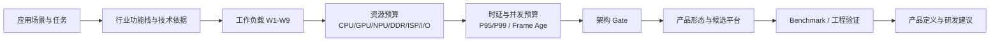
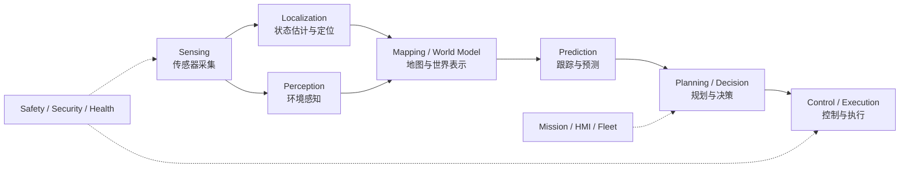
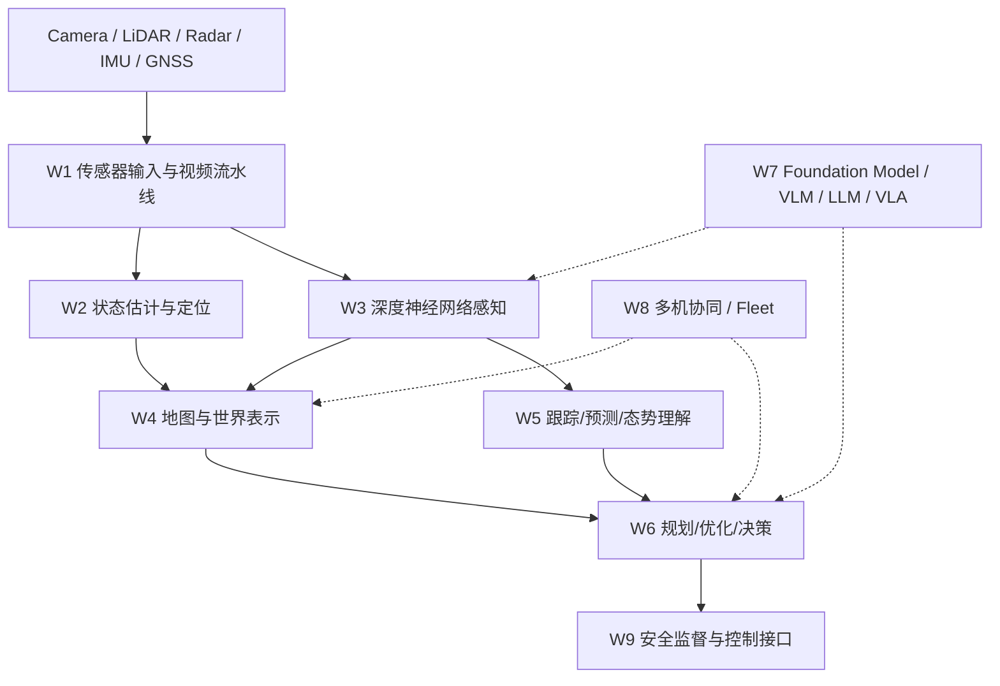
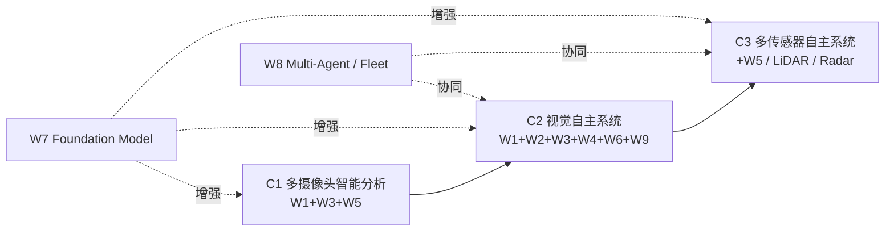
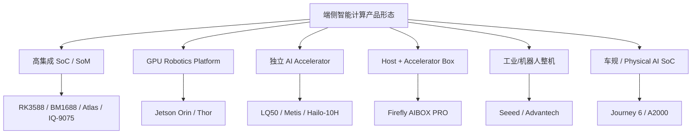
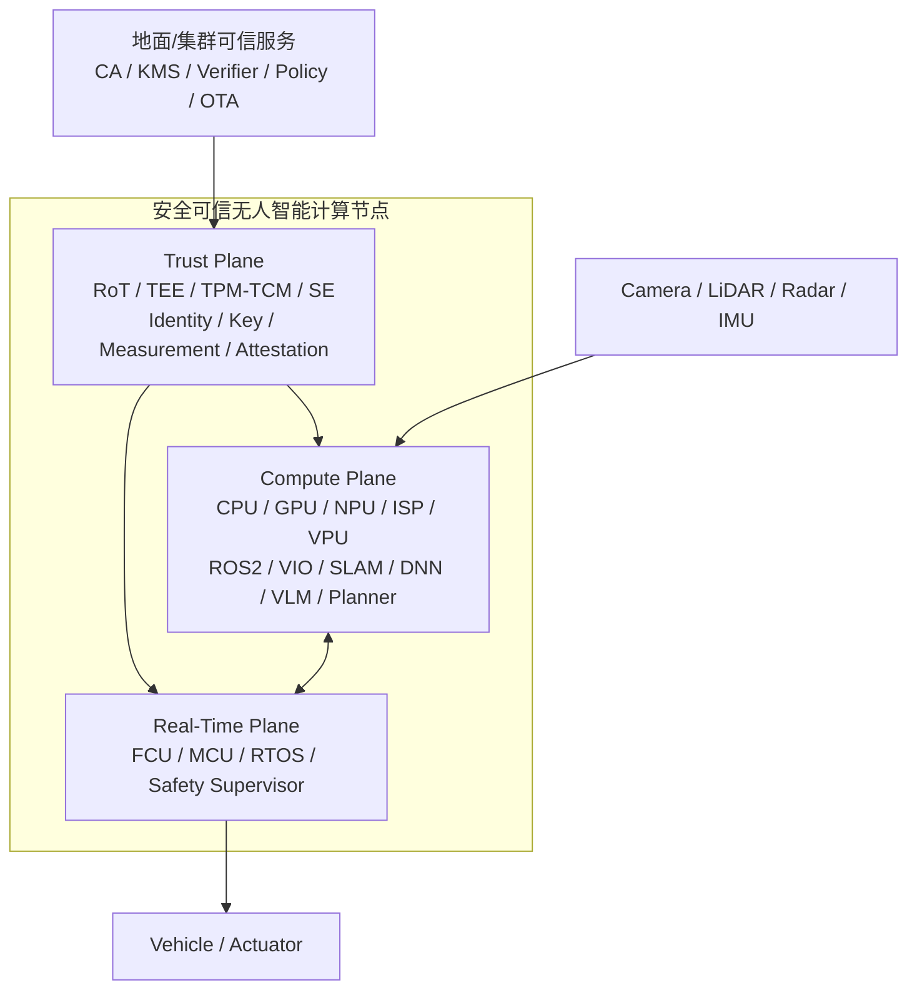
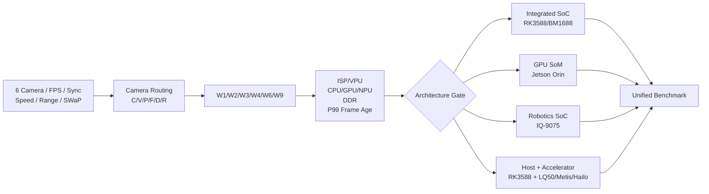
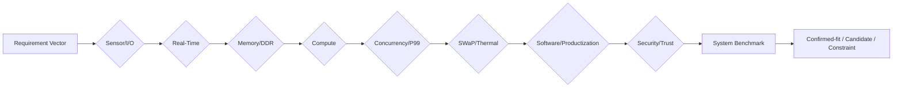

# 面向无人装备的安全可信端侧智能计算平台技术调研报告

> 版本：v0.5（技术报告体例重构版）  
> 日期：2026-10-08  
> 状态：Final Report Draft  
> 研究仓库：edge-intelligence-research  
> 参考文献索引：[`references/final-report-reference-index-v0.5.md`](../../references/final-report-reference-index-v0.5.md)  
> 产品资料时效复核：[`references/webpages/product-refresh-2026-10-08.md`](../../references/webpages/product-refresh-2026-10-08.md)

---

# 摘要

面向无人机、无人车、无人船、自主移动机器人以及固定式边缘智能设备，端侧智能计算平台正在由传统的视频处理节点或单一神经网络推理加速器，演变为集多传感器接入、异构计算、定位导航、环境感知、地图构建、任务规划、实时控制协同和安全可信于一体的系统级计算平台。

本报告围绕“应用场景—智能任务—工作负载—系统资源—计算架构—芯片与产品—工程验证”主线开展研究。报告首先基于 PX4、Nav2、Autoware、Waymo 以及无人系统相关论文和标准，梳理无人装备通用功能链；在此基础上，为满足硬件资源预算与平台选型需求，将跨领域反复出现的计算任务抽象为 W1～W9 九类工作负载，并进一步形成 C1～C5 五类典型工作负载组合。上述分类属于本项目面向资源分析的研究方法，不作为行业标准或自主等级使用。

报告认为，无人装备计算平台不能以 TOPS 作为唯一选型依据。除神经网络推理能力外，多摄像头接入能力、ISP/VPU、CPU/GPU、内存容量与带宽、Camera/SerDes/PCIe/Ethernet/CAN 等接口、P95/P99 尾延迟、Frame Age、功耗与散热、ROS 2/模型工具链以及安全可信能力同样决定系统最终可用性。

在产品调研方面，本报告对 NVIDIA Jetson、Qualcomm Dragonwing IQ-9075、Rockchip RK3588、Huawei Atlas 200I A2、SOPHGO BM1688、Houmo LQ50、Axelera Metis、Hailo-10H、Firefly AIBOX PRO、Seeed reComputer、Advantech MIC-733、Horizon Journey 6、Black Sesame A2000 等代表性产品和平台进行分类分析。调研表明，当前市场已形成高集成 SoC/SoM、GPU 机器人平台、独立 M.2/PCIe AI 加速卡、Host+Accelerator 异构计算盒、工业机器人计算机以及车规/Physical AI SoC 等多条技术路线。不同产品形态在数据通路、实时性、软件生态、SWaP 和工程成熟度方面差异明显，不宜直接按 TOPS 横向排名。

针对公司在密码安全和可信计算方面的技术基础，本报告提出“Compute Plane + Real-Time Plane + Trust Plane”三平面安全可信无人智能计算平台架构，并结合 GB/T 38638-2020、GB/T 29829-2022、GM/T 0011-2023、GM/T 0012-2020、GM/T 0028-2024 等国内可信计算与商用密码标准，给出设备身份、可信启动、平台度量、远程证明、模型可信、通信安全、安全升级和设备失陷处置等能力建议。

六摄像头无人平台作为本报告的工程案例，用于验证“需求—工作负载—资源—候选架构—Benchmark”方法。当前阶段建议优先冻结摄像头实际帧率、Camera Routing、VIO/Depth/Detection 路数、飞行速度、有效探测距离、机体响应和 SWaP 约束，并在此基础上对一体化 SoC、GPU SoM 和 Host+Accelerator 等路线开展系统级 Benchmark。

**关键词：** 无人装备；端侧智能；异构计算；视觉自主；VIO；SLAM；VLM；AI 加速器；安全可信；商用密码；可信计算

---

# 1 调研概述

## 1.1 调研背景

随着无人装备自主能力不断提升，计算任务已经由早期的飞控、视频编码和遥测，扩展到环境感知、视觉定位、地图构建、自主避障、轨迹规划和任务理解。PX4 已将视觉—惯性里程计（VIO）、光流和 Collision Prevention 纳入无人机计算链路；Nav2 将移动机器人导航划分为状态估计、环境表示、规划和控制；Autoware 则形成 Sensing、Localization、Perception、Planning、Control 等完整自动驾驶软件栈。[R04](../../references/final-report-reference-index-v0.5.md#r04)[R07](../../references/final-report-reference-index-v0.5.md#r07)[R08](../../references/final-report-reference-index-v0.5.md#r08)

上述事实表明，无人装备的“算力”已经不是单一 AI 推理问题，而是多类工作负载在同一平台上的协同问题。平台选型需要同时处理数据吞吐、计算、内存、实时性、接口、软件和安全约束。

## 1.2 调研目标

本报告重点回答以下问题：

1. 无人装备当前主要智能能力和计算任务是什么；
2. 不同任务对应哪些计算工作负载；
3. 工作负载对 CPU、GPU、NPU、DDR、ISP/VPU、I/O、实时性和功耗提出什么要求；
4. 高集成 SoC、GPU 平台、AI 加速卡、Host+Accelerator 和工业计算机分别适用于什么场景；
5. 当前国内外代表性产品已达到什么水平；
6. 六摄像头无人平台应采用何种架构，并需要哪些工程验证；
7. 公司如何结合密码安全和可信计算形成差异化产品方向。

## 1.3 研究方法

本报告采用需求驱动的技术研究方法，技术链如图 1 所示。

**图 1 端侧智能计算平台调研方法**



图源：[`assets/diagrams/final-report-methodology-evidence-chain-v03.mmd`](../../assets/diagrams/final-report-methodology-evidence-chain-v03.mmd)

平台分析不从某个芯片的 TOPS 倒推应用，而是首先建立 Requirement Vector，包括任务、传感器、数据率、同步、并发、更新率、deadline、内存、接口、SWaP-C、安全与软件要求，再进行架构筛选。

## 1.4 证据规则

报告统一使用以下证据状态：

| 类型 | 含义 |
|---|---|
| FACT | 标准、官方规范或可靠公开事实 |
| SPEC | 官方 Datasheet、Manual、Developer Guide |
| CASE | 已存在的真实产品或系统案例 |
| BENCH | 条件明确的 Benchmark |
| PAPER | 同行评审论文或高质量综述 |
| VENDOR | 厂商公开宣称，尚未独立验证 |
| INFER | 基于事实形成的工程推断 |
| GAP | 当前证据或项目参数不足 |

关键判断优先引用标准、官方文档和论文；产品规格引用具体 SKU，不跨型号继承。

---

# 2 无人装备端侧智能功能与应用需求

## 2.1 通用功能链

综合 PX4、Nav2、Autoware 和 Waymo 等成熟系统，可将无人装备核心信息处理过程概括为：

**图 2 无人装备通用功能链**



Waymo 对自动驾驶软件的公开描述“Where am I / What’s around me / What will happen next / What should I do”与上述功能链高度一致。[R10](../../references/final-report-reference-index-v0.5.md#r10)

## 2.2 无人机

无人机应用包括巡检、测绘、监视、物流、搜索救援以及 GNSS 拒止环境自主飞行。其端侧计算特点是 SWaP-C 约束最强，同时对快速运动状态下的同步和闭环时延较为敏感。

在 GNSS 不可靠环境中，VIO 通过 Camera 与 IMU 融合持续估计飞行器位置和姿态；当系统增加障碍检测、局部地图和路径规划后，计算节点即进入完整视觉自主闭环。[R05](../../references/final-report-reference-index-v0.5.md#r05)[R06](../../references/final-report-reference-index-v0.5.md#r06)[R11](../../references/final-report-reference-index-v0.5.md#r11)

## 2.3 UGV/自动驾驶

无人车平台通常具备更高功耗预算，可同时部署 Camera、LiDAR、Radar、GNSS/IMU。Autoware 和 Waymo 表明，高阶 UGV 计算不只包含目标检测，还包括多传感器融合、动态对象预测、BEV/Occupancy 表示以及行为和轨迹规划。[R08](../../references/final-report-reference-index-v0.5.md#r08)[R09](../../references/final-report-reference-index-v0.5.md#r09)[R10](../../references/final-report-reference-index-v0.5.md#r10)

该类系统是 C3 多传感器自主计算的典型代表，对内存容量、带宽、传感器同步和异构计算要求较高。

## 2.4 AMR 与机器人

AMR 核心任务包括定位、地图、全局规划、局部避障和 Fleet 管理。Nav2 的架构表明，状态估计、环境表示、planner 和 controller 在移动机器人中是稳定存在的工程模块。[R07](../../references/final-report-reference-index-v0.5.md#r07)

具身机器人进一步引入 VLM/VLA。PaLM-E、RT-2、OpenVLA 表明视觉、语言、状态和动作可以由大模型统一建模，但 onboard memory、latency 和 safety constraints 仍是端侧部署的主要限制。[R18](../../references/final-report-reference-index-v0.5.md#r18)[R19](../../references/final-report-reference-index-v0.5.md#r19)[R20](../../references/final-report-reference-index-v0.5.md#r20)[R21](../../references/final-report-reference-index-v0.5.md#r21)

## 2.5 USV 与固定边缘设备

USV 的典型特点是 Radar/AIS/Camera/GNSS 多源融合、长航时和复杂目标避碰。[R13](../../references/final-report-reference-index-v0.5.md#r13)

固定式边缘设备虽然没有本体定位和控制，但可能需要 8 路、16 路甚至更多视频并发分析。因此，自主程度与计算量并非同一概念，这也是后续划分 C1 多摄像头智能分析的重要原因。

---

# 3 工作负载模型 W1～W9

## 3.1 分类依据

W1～W9 是本项目面向硬件资源预算建立的 Workload Taxonomy，并非行业标准或自主能力等级。

其外部功能依据主要来自：

- PX4：VIO、Optical Flow、Collision Prevention；[R04](../../references/final-report-reference-index-v0.5.md#r04)[R05](../../references/final-report-reference-index-v0.5.md#r05)[R06](../../references/final-report-reference-index-v0.5.md#r06)
- Nav2：State Estimation、Environment Representation、Planning、Control；[R07](../../references/final-report-reference-index-v0.5.md#r07)
- Autoware：Sensing、Localization、Perception、Planning、Control；[R08](../../references/final-report-reference-index-v0.5.md#r08)[R09](../../references/final-report-reference-index-v0.5.md#r09)
- Waymo：定位、感知、预测、决策；[R10](../../references/final-report-reference-index-v0.5.md#r10)
- GNSS-denied UAV、USV、多机器人综述；[R11](../../references/final-report-reference-index-v0.5.md#r11)[R12](../../references/final-report-reference-index-v0.5.md#r12)[R13](../../references/final-report-reference-index-v0.5.md#r13)
- PaLM-E、RT-2、OpenVLA 等 Foundation Model/VLA 路线。[R18](../../references/final-report-reference-index-v0.5.md#r18)[R19](../../references/final-report-reference-index-v0.5.md#r19)[R20](../../references/final-report-reference-index-v0.5.md#r20)

W1～W9 的划分遵循五项原则：主导资源不同、时延语义不同、状态生命周期不同、验证方法不同、对架构 Gate 的影响不同。详细定义依据见 [W1–W9 工作负载分类定义依据](../../research/workloads/workload-taxonomy-definition-basis-v1.md)。

## 3.2 分类结果

**图 3 W1～W9 工作负载关系**



## 3.3 工作负载定义及主要资源

| ID | 中文名称 | 典型算法/功能 | 主要资源 | 主要评价指标 |
|---|---|---|---|---|
| W1 | 传感器输入与视频流水线 | Camera、ISP、resize、codec、同步、DMA | ISP/VPU、DDR、Camera I/O | Pixel Rate、drop、timestamp jitter |
| W2 | 状态估计与定位 | VO、VIO、GNSS/INS、SLAM 前端 | CPU/GPU、低延迟内存 | latency、精度、同步 |
| W3 | 深度神经网络感知 | Detection、Segmentation、Depth、Pose | NPU/GPU、DDR | latency、FPS、模型覆盖 |
| W4 | 地图与世界表示 | SLAM Map、Costmap、BEV、Occupancy | CPU/GPU、Memory/DDR | map update、memory、latency |
| W5 | 跟踪/预测/态势理解 | MOT、Trajectory Prediction、Scene Understanding | CPU/GPU/NPU、时序状态 | update rate、prediction latency |
| W6 | 规划/优化/决策 | A*、RRT、MPC、Behavior Planning | CPU/GPU | worst-case latency |
| W7 | 基础模型/VLM/LLM/VLA | VLM、LLM、VLA | GPU/NPU、Memory/BW | TTFT、token/s、action latency |
| W8 | 多机协同/Fleet | Task Allocation、Shared Map、Cooperative Perception | Network、CPU/GPU | network QoS、state consistency |
| W9 | 安全监督与控制 | FCU、Supervisor、Failsafe、Health | MCU/RT core/CPU | deadline、jitter、fault isolation |

---

# 4 典型工作负载组合 C1～C5

## 4.1 组合定义

C1～C5 用于描述现实系统中常见的多 workload 并发组合。它们是资源预算模板，不是能力等级。详细来源见 [C1–C5 工作负载组合定义依据](../../research/workloads/workload-composition-definition-basis-v1.md)。

**图 4 C1～C5 关系**



图源：[`assets/diagrams/final-report-composition-map-v05.mmd`](../../assets/diagrams/final-report-composition-map-v05.mmd)

## 4.2 C1 多摄像头智能分析

C1 对应固定式视频分析、工业视觉和多摄跟踪系统，主要由 W1、W3、W5 组成。NVIDIA Metropolis 等平台长期面向 multi-camera analytics、tracking 和 inspection，说明此类系统具有明确产业基础。[R47](../../references/final-report-reference-index-v0.5.md#r47)

C1 的特点是视频和 AI 负载可能很重，但不存在本体定位和控制，因此适合视频 SoC、NPU accelerator 和 Host+Accelerator 架构。

## 4.3 C2 视觉自主系统/视觉自主闭环

C2 由 W1、W2、W3、W4、W6 和 W9 组成，对应视觉真正参与导航和运动控制的系统。

PX4 VIO、Collision Prevention、Nav2 以及 Isaac ROS 多摄 VSLAM/Depth/Mapping 均体现这一组合。[R05](../../references/final-report-reference-index-v0.5.md#r05)[R06](../../references/final-report-reference-index-v0.5.md#r06)[R07](../../references/final-report-reference-index-v0.5.md#r07)[R24](../../references/final-report-reference-index-v0.5.md#r24)

六摄像头 UAV 当前基础目标最接近 C2。

## 4.4 C3 多传感器自主系统

C3 在 C2 基础上突出 W5 Prediction/Tracking，并引入 LiDAR、Radar 等多类传感器。Autoware、Waymo 和 USV 多源融合体系均属于该类。[R08](../../references/final-report-reference-index-v0.5.md#r08)[R10](../../references/final-report-reference-index-v0.5.md#r10)[R13](../../references/final-report-reference-index-v0.5.md#r13)

C3 对时间同步、内存带宽、动态预测和多传感器 I/O 要求显著高于 C2。

## 4.5 C4 基础模型增强机器人/无人系统

C4 表示在 C1/C2/C3 基础上叠加 W7。Foundation Model 增加了大模型权重、KV Cache、视觉编码器和生成式推理负载。

C4 不是“更高自主等级”，其价值主要体现在任务理解、语义推理和高层策略增强。

## 4.6 C5 协同自主系统

C5 表示在 C2/C3 上增加 W8，用于 Fleet、多机协同和共享感知。核心新增约束是 Network QoS、distributed state、task allocation 以及 Fleet identity/trust。[R12](../../references/final-report-reference-index-v0.5.md#r12)[R15](../../references/final-report-reference-index-v0.5.md#r15)

---

# 5 端侧计算资源需求分析

## 5.1 数据吞吐与 Camera Routing

对多摄系统，首先计算像素率：

```text
PixelRate = Σ(N × Width × Height × FPS)
```

但实际 DDR 工作流量还受 RAW/NV12/RGB 格式、ISP 输出、resize、codec、AI 和 recording 读写次数影响。

本报告采用 Camera Routing Set：

```text
C = Capture
V = VIO/SLAM
P = Per-view Perception
F = Fused Multi-view
D = Depth
R = Recording
```

其目的在于区分“物理摄像头数量”和“算法实际消费路数”。

## 5.2 CPU

CPU 主要承担 Linux/ROS 2、驱动、VIO 图优化、tracking、planning、network、storage 等任务。对于 C2/C3，CPU 是核心资源之一，而不是 NPU 的附属处理器。

## 5.3 GPU

GPU 适合 VSLAM、Depth、Point Cloud、BEV、Transformer 和自定义并行算法。GPU 的优势是通用性和软件生态，代价是功耗与散热通常高于专用 NPU。

## 5.4 NPU/AI ASIC

NPU 适合 Detection、Segmentation、Depth 网络和量化 Transformer。真实性能取决于算子覆盖、compiler、precision、dynamic shape 和多模型并发能力。

独立 M.2/PCIe accelerator 只能承担可卸载的 W3/W7，不替代 Host 对 W1/W2/W4/W6 的职责。

## 5.5 Memory/DDR

运行内存需求包括 OS、Runtime、Weights、Activation、Camera Buffer、VIO/SLAM 状态、Map、Queue 和 KV Cache。随着 C4 引入 VLM/VLA，内存容量和带宽的重要性进一步提高。

## 5.6 实时性

闭环反应时间应表示为：

```text
T_reaction =
T_sample + T_sensor/ISP + T_queue + T_perception
+ T_fusion/map + T_planner + T_command + T_vehicle
```

对应反应距离：

```text
D_reaction = speed × T_reaction
```

因此避障平台评价应采用 P95/P99 Frame Age、deadline miss 和热稳态数据，而不是单一模型平均 FPS。

---

# 6 端侧计算技术路线

## 6.1 高集成 SoC/SoM

CPU、GPU/NPU、ISP/VPU 和 I/O 集成于同一 SoC 或模块，具有数据路径短、共享内存和 SWaP 优势，适合无人机、AMR 和小型机器人。

典型代表包括 RK3588、BM1688、Atlas 200I A2、IQ-9075。

## 6.2 GPU 机器人计算平台

以 Jetson Orin 为代表，具有 GPU 通用并行计算能力和 CUDA/TensorRT/Isaac ROS 软件生态，适合 C2/C3/C4 的多 workload 混合部署。

## 6.3 独立 AI Accelerator

以 LQ50、Metis、Hailo-10H 等为代表，通过 M.2/PCIe 接入 Host，适合增加 W3/W7 推理能力。

## 6.4 Host + Accelerator

Host 负责 Camera、ISP、CPU workload 和规划，Accelerator 负责 DNN/大模型。Firefly AIBOX PRO 表明该路线已经产品化。[R37](../../references/final-report-reference-index-v0.5.md#r37)

## 6.5 实时控制器 + Companion Computer

FCU/MCU 负责姿态和执行机构实时控制，Linux AI Computer 负责感知、SLAM 和规划。该架构可降低 AI/Linux 抖动对硬实时控制的影响。

## 6.6 工业机器人计算机与车规 Physical AI SoC

工业计算机侧重 GMSL/CAN、宽压、工业温度和长期运行；车规 SoC 则强调高算力、多传感器、安全岛和自动驾驶/Physical AI。

二者对 UGV/USV/AMR 具有较强参考意义，但不应直接作为小型 UAV 候选。

**图 5 端侧智能计算产品形态**



图源：[`assets/diagrams/final-report-product-landscape-v05.mmd`](../../assets/diagrams/final-report-product-landscape-v05.mmd)

---

# 7 国内外现有端侧智能计算产品调研

## 7.1 调研范围与分类原则

产品调研不是对芯片 TOPS 进行排序，而是分析当前市场是否已经形成可采购、可集成和可产品化的计算形态。

本报告区分：

1. SoC/SoM/核心板；
2. GPU Robotics Platform；
3. M.2/PCIe 独立 AI Accelerator；
4. Host+Accelerator 异构计算盒；
5. 工业/机器人整机；
6. 车规/Physical AI SoC。

2026-10-08 对关键官方产品页面再次复核，主要规格与 9 月底产品数据库一致。复核记录见 [产品公开资料复核](../../references/webpages/product-refresh-2026-10-08.md)。

## 7.2 高集成 SoC/SoM

### 7.2.1 NVIDIA Jetson AGX Orin

Jetson AGX Orin 64GB 是当前机器人和自主系统中具有代表性的 GPU SoM。官方规格给出最高 275 TOPS、64GB LPDDR5、约 204.8GB/s 内存带宽，模块功耗档位 15～60W，并同时提供 Arm CPU、Ampere GPU、DLA、视频编解码和高速 I/O。[R35](../../references/final-report-reference-index-v0.5.md#r35)

其工程价值主要在于 CUDA、TensorRT 和 Isaac ROS 软件生态。Isaac ROS 已提供 Visual SLAM、Depth、Mapping 等组件和系统级 Benchmark。[R22](../../references/final-report-reference-index-v0.5.md#r22)[R23](../../references/final-report-reference-index-v0.5.md#r23)[R24](../../references/final-report-reference-index-v0.5.md#r24)

**工程判断：** Jetson Orin 适合 C2/C3/C4，特别适合算法快速演进和复杂 GPU workload，但对小型 UAV 需要重点评估模块、载板、散热器和电源后的整机 SWaP。

### 7.2.2 Qualcomm Dragonwing IQ-9075

IQ-9075 是面向工业 AI、AMR 和 Drone 的高集成异构 SoC。官方当前给出 50/100 Dense INT8 TOPS、最高 36GB LPDDR5 ECC、最多 16 路 Camera、8 核 Kryo CPU、Adreno GPU、Hexagon NPU，以及独立 4 核实时子系统。[R36](../../references/final-report-reference-index-v0.5.md#r36)

该平台同时具备 PCIe Gen4、2.5GbE TSN、CAN-FD 和 Linux/Ubuntu 支持，体现出“机器人 SoC”向 AI + RT + I/O 一体化发展的趋势。

**工程判断：** IQ-9075 对 C2/C3 很有吸引力，尤其适合多摄像头和实时协同。但“最多 16 Camera”属于 SoC capability，不能直接等同具体板卡能无桥接支持本项目六摄同步模式；Full-stack P99 仍需实测。

### 7.2.3 RK3588

RK3588 是国内低成本端侧 AI 平台的重要代表，具备 4×Cortex-A76 + 4×A55、Mali-G610 GPU、6 TOPS NPU、ISP 和 8K 视频能力。其优势是成本、生态和大量现成板卡。

当前公开证据已覆盖官方 DNN Benchmark 和部分 SLAM 论文，但多 Camera + VIO + DNN + Planner 的并发系统性能仍缺统一公开数据。

**工程判断：** RK3588 更适合作为 C1、轻量 C2 和 Host+Accelerator 的 Host。对六摄 UAV 不应因“6 TOPS 较低”直接排除，也不能因“支持多 Camera”直接判定满足 C2。

### 7.2.4 Huawei Atlas 200I A2

Atlas 200I A2 是国产高集成边缘模块，官方给出 20 TOPS INT8、10 TFLOPS FP16、4/8/12GB LPDDR4X ECC、ISP/视频、PCIe/Ethernet/MIPI/SATA/USB/CAN，20 TOPS 版本典型功耗约 25W，尺寸约 82×60×7mm。[R41](../../references/final-report-reference-index-v0.5.md#r41)

官方应用明确包含机器人和无人机。

**工程判断：** Atlas 200I A2 适合作为国产 C1/C2/C3 候选，但需要重点评估 CANN/MindSDK 软件迁移成本、ROS/算法生态和项目所需 Camera 同步能力。

### 7.2.5 BM1688 / Firefly AIO-1688JD4

Firefly BM1688 板级方案公开给出 16 TOPS INT8、4 TFLOPS FP16/BF16、16 路 1080p30 解码、10 路 1080p30 编码，并明确支持 6-channel sensor input 和 ISP。[R42](../../references/final-report-reference-index-v0.5.md#r42)

**工程判断：** 这是当前调研产品中与六摄像头 W1 最直接相关的国产板级方案之一。其“6 路 sensor input”属于很强的 Camera 侧事实证据，但并不能直接证明六路项目模式下的同步、VIO 和 C2 并发能力。

## 7.3 独立 AI Accelerator

### 7.3.1 Houmo LQ50

LQ50-24GB 是基于 M50 的 M.2 2280 加速卡，官方给出 160 TOPS、100 TFLOPS@bFP16、24GB LPDDR5/LPDDR5X、153.6GB/s、PCIe Gen4 x4、典型 13W、约 9g。[R38](../../references/final-report-reference-index-v0.5.md#r38)

较大的板载内存使其具备 W3 和 W7 的潜力，特别适合向已有 Host 增加大模型和视觉推理能力。

**工程判断：** LQ50 是“Host+国产高算力 Accelerator”路线的重要代表，但 160 TOPS 只说明卡本身 AI 计算能力。Camera/ISP、VIO、Map、Planner 和 FCU 接口仍由 Host 承担。

### 7.3.2 Axelera Metis

Metis M.2 产品最高约 214 TOPS，支持 Arm Host，适合计算机视觉推理。其优势是较高能效和可嵌入性。[R39](../../references/final-report-reference-index-v0.5.md#r39)

**工程判断：** 适合作为 W3 专用卸载引擎，但需要将散热器、Host slot power、PCIe 和 Host CPU/DDR 纳入整机评估。

### 7.3.3 Hailo-10H

Hailo-10H M.2 提供 40 TOPS INT4/20 TOPS INT8，并配置 4GB/8GB 板载内存，面向 CV 和端侧生成式 AI。[R40](../../references/final-report-reference-index-v0.5.md#r40)

厂商不同材料对典型功耗存在 <2.5W 和 <3.5W 的条件差异，因此报告不将其合并为单一精确功耗。

**工程判断：** Hailo-10H 适合低功耗 W3/W7 扩展，但仍依赖 Host 完成机器人完整计算链。

## 7.4 Host+Accelerator 与整机产品

### 7.4.1 Firefly AIBOX PRO

AIBOX PRO 采用 RK3588/RK3576 Host，并提供双 M.2 accelerator slot，官方支持后摩 LQ50、RK1828、DeepX DX-M1 等卡，整机提供双 GbE、CAN-FD、RS485、DI/DO 和 9～36V 输入。[R37](../../references/final-report-reference-index-v0.5.md#r37)

其意义在于证明：

> **Host+Accelerator 已经从架构概念进入完整商业产品阶段。**

当前公开资料中 Firefly 对某 LQ50 配置的内存表述与后摩 LQ50-24GB 当前官方指南存在差异，因此 exact accelerator SKU 仍标记为未确认。

**工程判断：** 该路线适合 C1、W3/W7 扩展，并可作为 C2 候选，但必须实测 Camera→Host→PCIe→Accelerator→Host→Planner 的完整 E2E 时延。

### 7.4.2 Seeed reComputer Robotics / Industrial

Seeed reComputer Robotics/Industrial 系列基于 Jetson Orin NX/Nano，并集成 Ethernet、CAN、串口等机器人接口；部分 Robotics 型号提供 GMSL 摄像头能力。[R43](../../references/final-report-reference-index-v0.5.md#r43)

**工程判断：** 该产品形态比 Developer Kit 更接近实际机器人整机，适合 UGV、USV、AMR。已公开 Robotics 产品重量约 1kg 级，对小型 UAV 通常过重。

### 7.4.3 Advantech MIC-733-AO

MIC-733-AO 是基于 Jetson AGX Orin 的工业 AI 计算机，支持 4×GbE、可选 PoE、可选 2 路 GMSL、9～36V、fanless，整机重量约 4.5kg。[R44](../../references/final-report-reference-index-v0.5.md#r44)

**工程判断：** 该产品展示了工业级“芯片→整机”的产品化路径，适合固定边缘、UGV 和工业机器人，但显然不属于小型 UAV SWaP 范围。

## 7.5 车规/Physical AI 平台

### 7.5.1 Horizon Journey 6

Journey 6 系列面向高阶辅助驾驶和智能驾驶。Journey 6M 公开算力约 128 TOPS，并拥有面向车载多传感器和 E2E 的软硬件生态。

**工程判断：** Journey 6 说明国产车规 SoC 已形成较高成熟度的 C3 路线，但其产品形态、接口和开发流程面向车载，不宜直接与无人机 SoM 横向比较。

### 7.5.2 Black Sesame A2000

2026 年官方公开的 A2000N/L/U/X 家族覆盖约 200～1000 TOPS，支持 INT4/INT8/FP8/FP16/FP32，采用近存计算和自研 ISP，并面向 Physical AI、L3/L4 和机器人方向。

**工程判断：** A2000 体现下一代车规/Physical AI SoC 的技术趋势：大算力、混合精度、近存计算、VLM/VLA 和功能安全深度集成。1000 TOPS 属于家族最高规格，不能用于代表全部 A2000 SKU；其对小型 UAV 的 SWaP 和可采购性需要单独评估。

## 7.6 代表产品横向对比

原始数据：[`data/product-specs/final-report-representative-products-v05.csv`](../../data/product-specs/final-report-representative-products-v05.csv)

| 平台/产品 | 形态 | 主要算力/内存 | Camera/视频特点 | SWaP 特点 | 更适合的场景 | 主要未验证项 |
|---|---|---|---|---|---|---|
| Jetson AGX Orin | GPU SoM | 275 TOPS；64GB；204.8GB/s | MIPI CSI、视频、Isaac ROS | 15～60W | C2/C3/C4 | 小型 UAV 整机 SWaP |
| IQ-9075 | Robotics SoC | 50/100 TOPS；36GB ECC | up to 16 Camera；RT subsystem | SoC 3.8～20W | C2/C3/C4 | 本项目六摄同步、Full-stack P99 |
| RK3588 | SoC | 6 TOPS；板级内存 | ISP+8K视频 | 低成本、板型多 | C1、轻量 C2、Host | 多 workload 并发 |
| Atlas 200I A2 | 国产模块 | 20 TOPS；4/8/12GB | ISP/视频/多 I/O | 25W；82×60mm | C1/C2/C3 | 软件迁移、Camera sync |
| BM1688 | 国产视觉 SoC | 16 TOPS | 6 sensor input；多路 codec | 板级 | C1、六摄 W1 候选 | C2 软件/并发 |
| LQ50 | M.2 Accelerator | 160 TOPS；24GB | Host dependent | 13W；约9g | W3/W7 offload | Host+PCIe E2E |
| Metis | M.2 Accelerator | up to 214 TOPS | Host dependent | 低功耗 accelerator | W3 offload | 散热、Host path |
| Hailo-10H | M.2 Accelerator | 40 TOPS INT4；4/8GB | Host dependent | 低功耗 | W3/W7 | 系统级闭环 |
| AIBOX PRO | 异构整机 | RK Host + dual M.2 | Host media + accelerator | 160×111×61mm | C1/C4；C2候选 | Camera/VIO/P99 |
| reComputer Robotics | 机器人整机 | Orin NX | GMSL/CAN 等 | 约 kg 级 | UGV/USV/AMR | 小型 UAV 重量 |
| MIC-733 | 工业整机 | AGX Orin | 4GbE/可选GMSL | 4.5kg | 工业/UGV | 不适小型 UAV |
| Journey 6M | 车规 SoC | 128 TOPS | 车载多传感器 | 车规 | C3 | 非 UAV 产品形态 |
| A2000 family | Physical AI SoC | 200～1000 TOPS family | ISP/车载接口 | 车规 | C3/C4 | SKU、SWaP、可采购性 |

## 7.7 产品调研结论

现有产品调研形成以下结论：

1. **一体化 SoC/SoM 仍是小型无人装备优先路线。** 其优势在于 Camera、ISP、DDR 和计算引擎处于同一内存域，数据路径短，SWaP 较容易控制。
2. **独立 Accelerator 的价值主要是 W3/W7 扩展。** 其 TOPS 不能替代 Host 的 Camera、VIO、Planning 和实时控制能力。
3. **Host+Accelerator 已经形成成熟商业形态。** Firefly AIBOX PRO 是典型例证，但该路线的系统瓶颈从“卡算力”转移到 Host、PCIe、预后处理和散热。
4. **工业整机已具备机器人接口和可靠性设计。** 但重量和体积决定其主要面向 UGV、USV、AMR，而非小型 UAV。
5. **车规/Physical AI SoC 正向高算力、多模态和实时/安全融合发展。** 其技术趋势值得跟踪，但不能直接作为 UAV 产品选型结论。
6. **国产产品已经覆盖 SoC、模块、Accelerator 和整机多个层次。** 当前主要缺口不是“没有算力”，而是 ROS/VIO/多 workload 并发、P95/P99 和完整系统 Benchmark 的公开证据不足。

---

# 8 安全可信端侧智能计算架构

## 8.1 设计需求

无人装备具有无人值守、网络不稳定、设备可能被获取、任务数据和模型敏感等特点，因此安全应从设备启动、运行、通信、升级到失陷处置形成完整链路。

## 8.2 三平面架构

**图 6 安全可信无人智能计算平台总体架构**



Compute Plane 负责智能计算；Real-Time Plane 负责确定性闭环；Trust Plane 负责设备、软件、模型和密钥的可信状态。

## 8.3 国内标准依据

国产 Trust Plane 可形成如下标准链：

- GB/T 38638-2020：可信计算体系结构；[R48](../../references/final-report-reference-index-v0.5.md#r48)
- GB/T 29829-2022、GM/T 0011-2023：可信密码支撑平台；[R49](../../references/final-report-reference-index-v0.5.md#r49)[R50](../../references/final-report-reference-index-v0.5.md#r50)
- GM/T 0012-2020：可信密码模块接口；[R51](../../references/final-report-reference-index-v0.5.md#r51)
- GM/T 0013-2021：TCM 接口符合性测试；[R52](../../references/final-report-reference-index-v0.5.md#r52)
- GM/T 0058-2018：TCM 服务模块接口；[R53](../../references/final-report-reference-index-v0.5.md#r53)
- GM/T 0079-2020：可信计算平台直接匿名证明；[R54](../../references/final-report-reference-index-v0.5.md#r54)
- GM/T 0082-2020：可信密码模块保护轮廓；[R55](../../references/final-report-reference-index-v0.5.md#r55)
- GM/T 0028-2024：密码模块安全要求；[R56](../../references/final-report-reference-index-v0.5.md#r56)
- GM/T 0132-2023：信息系统密码应用实施指南；[R57](../../references/final-report-reference-index-v0.5.md#r57)
- GM/T 0115-2021：信息系统密码应用测评要求。[R58](../../references/final-report-reference-index-v0.5.md#r58)

SM2、SM3、SM4 国家标准可分别支撑设备身份/签名、完整性度量和数据保密。[R59](../../references/final-report-reference-index-v0.5.md#r59)[R60](../../references/final-report-reference-index-v0.5.md#r60)[R61](../../references/final-report-reference-index-v0.5.md#r61)

## 8.4 Trust Plane 能力建议

| 能力 | 技术实现方向 |
|---|---|
| 设备身份 | SE/TCM/TEE + SM2 certificate/key |
| Secure Boot | BootROM/eFuse/签名链 |
| Measured Boot | TCM/TPM/PCR-like measurement |
| Remote Attestation | Attester–Verifier–Relying Party |
| Secure Storage | TEE/SE/TCM sealed key + encrypted storage |
| AI Artifact Trust | 模型/配置签名、hash、版本、授权 |
| Communication Security | ROS 2 DDS Security、TLS/IPsec、MAVLink signing 等 |
| Secure OTA | 签名、版本、防回滚、恢复 |
| Capture Response | Debug lock、key revoke、fleet isolate |
| Domestic Crypto | SM2/SM3/SM4/TRNG + GM/T 接口/测评 |

---

# 9 六摄像头无人平台 Case Study

## 9.1 需求状态

当前已确认六路 Camera，单路 downstream 已观测 1072×1280 NV12；实际 FPS、六路模式一致性、N_detection、N_vio、N_depth、N_record、飞行速度、探测距离和 SWaP 仍需冻结。

## 9.2 需求—Workload—资源—候选架构

**图 7 六摄像头项目技术推导链**



图源：[`assets/diagrams/six-camera-requirement-resource-architecture-v03.mmd`](../../assets/diagrams/six-camera-requirement-resource-architecture-v03.mmd)

## 9.3 图像数据量敏感性

按 1072×1280 NV12、6 路计算：

| FPS | 六路 Pixel Rate | 一份 NV12 Payload |
|---:|---:|---:|
| 10 | 82.33 MP/s | 123.49 MB/s |
| 20 | 164.66 MP/s | 246.99 MB/s |
| 30 | 246.99 MP/s | 370.48 MB/s |
| 60 | 493.98 MP/s | 740.97 MB/s |
| 120 | 987.96 MP/s | 1481.93 MB/s |

上述仅为单份 image-plane 数据，不是 DDR 实测。实际系统还存在 ISP 写入、resize、DNN、录像和多 consumer fan-out。

## 9.4 候选架构分析

### 一体化 RK3588/BM1688

优势是成本、集成度和短数据路径；BM1688 具有 6-channel sensor input 公开规格。主要风险是 C2 场景下 VIO+DNN+Planning 的完整并发性能和 ROS/工具链成熟度。

### Jetson Orin

优势是 GPU 与 Isaac ROS，特别适合 VSLAM、Depth、Mapping 和多模型并发。风险是功耗、载板、散热和重量。

### IQ-9075

优势是多 Camera、36GB ECC、NPU、GPU 和独立实时子系统一体化。风险是本项目 exact Camera/同步和系统 P99 尚未实测。

### RK3588 + Accelerator

优势是把 W3/W7 从 Host 卸载，并可形成不同算力档位。主要风险是 PCIe 数据搬运、Host DDR、散热和系统 E2E latency。

## 9.5 推荐验证顺序

1. 六路同步采集和稳定性；
2. 六路 Camera + 录像/编码；
3. VIO/SLAM；
4. Detection/Depth；
5. VIO + Detection 并发；
6. Camera + VIO + Detection + Depth + Planner；
7. P50/P95/P99 Frame Age；
8. 30min/1h/2h thermal；
9. FCU 闭环；
10. Trust Plane 启动、模型、通信、OTA 验证。

---

# 10 Benchmark 与工程验证体系

平台最终选型必须由系统级 Benchmark 收敛。

**图 8 平台筛选流程**



图源：[`assets/diagrams/final-report-platform-selection-v05.mmd`](../../assets/diagrams/final-report-platform-selection-v05.mmd)

Benchmark 建议包括：

- W1：多 Camera、drop、timestamp、ISP、codec、DDR；
- W2：EuRoC/TUM-VI VIO/SLAM；
- W3：统一模型/输入/precision DNN；
- Full C2：Camera+VIO+Detection+Depth+Planner；
- Host+Accelerator：H2D/D2H、PCIe、E2E；
- Thermal：持续负载降频；
- Trust：Secure Boot、model tamper、attestation、rollback、unauthorized node。

---

# 11 技术发展趋势

## 11.1 多摄时空融合

BEV/Occupancy 等技术推动感知从逐帧单摄向多摄时空融合发展，增加 DDR、同步、temporal state 和 Transformer 计算需求。[R17](../../references/final-report-reference-index-v0.5.md#r17)

## 11.2 模块化架构与 End-to-End 并存

短中期更可能形成“传统定位/安全骨架 + 学习模型增强”的混合架构，而非全部传统模块一次性被 E2E 替代。

## 11.3 VLM/VLA 进入机器人端侧

PaLM-E、RT-2、OpenVLA 表明 VLM/VLA 已进入机器人研究与工程化阶段，但端侧仍受到 memory、latency、power 和 safety verification 限制。[R18](../../references/final-report-reference-index-v0.5.md#r18)[R19](../../references/final-report-reference-index-v0.5.md#r19)[R20](../../references/final-report-reference-index-v0.5.md#r20)[R21](../../references/final-report-reference-index-v0.5.md#r21)

## 11.4 SoC 向 AI + RT + Safety + Trust 融合

IQ-9075、Journey 6、A2000 等平台表明，新一代端侧芯片正把 NPU、GPU、实时子系统、ISP、功能安全和大模型能力进一步集成。

## 11.5 Fleet 与 Trust 融合

多机器人协同将设备身份、可信状态和网络准入转化为系统架构问题。Remote Attestation 与 Fleet Policy 具有明显结合空间。[R30](../../references/final-report-reference-index-v0.5.md#r30)

---

# 12 产品研发建议

## 12.1 产品定位

不建议把后续产品定义为“XX TOPS 国产算力盒”。建议定位为：

> **面向无人装备的安全可信端侧智能计算平台。**

产品核心能力应包括：

- 多传感器接入；
- CPU/GPU/NPU 异构计算；
- 实时控制协同；
- ROS 2/AI Runtime；
- 商用密码；
- 设备身份；
- Trusted Boot / Attestation；
- 模型可信；
- Secure OTA；
- Fleet Trust。

## 12.2 产品系列建议

### 轻量型 UAV Node

目标：小型无人机、轻量机器人。  
路线：Integrated SoC 优先，独立 FCU，低 SWaP，基础 Trust Plane。

### 高性能 Robotics Node

目标：UGV、USV、AMR、高级机器人。  
路线：GPU/Robotics SoC，大内存、多 Sensor、GMSL/CAN、高速网络。

### Host+Accelerator 扩展型

目标：需要不同 AI 档位或 W7 的产品。  
路线：统一 Host + 可替换 M.2/PCIe accelerator。

### Fleet Trust Service

目标：多设备身份、KMS、Verifier、Revocation、Policy、OTA。

## 12.3 研发优先级

近期优先：
1. 冻结六摄 Requirement；
2. 建立统一 Benchmark；
3. 对比一体 SoC 与 Host+Accelerator；
4. 构建最小 Trust Plane；
5. 用实测收敛产品规格。

---

# 13 结论

无人装备端侧智能计算平台的核心问题不是“需要多少 TOPS”，而是在给定任务、传感器、实时性、功耗、尺寸和安全约束下，哪些 workload 需要同时运行，以及它们如何竞争 CPU、GPU、NPU、DDR、ISP、I/O 和实时资源。

W1～W9 和 C1～C5 的作用是把复杂应用转化为可预算、可比较、可验证的工程模型。其中 W1～W9 面向单类工作负载，C1～C5 面向典型系统组合；它们均建立在 PX4、Nav2、Autoware、Waymo、Foundation Model 和多机器人等公开技术事实之上，不作为行业等级使用。

产品调研表明，端侧市场已经从单一 SoC 扩展为 SoM、GPU 机器人平台、AI Accelerator、Host+Accelerator 和工业整机等多层产品形态。NVIDIA 在 GPU 和软件生态方面成熟，Qualcomm 正强化机器人 SoC 的多 Camera 和实时子系统，国产平台已覆盖 RK3588、Atlas、BM1688、后摩 LQ50、Journey 6、A2000 等多条路线。当前国产平台的主要短板更集中在软件生态、公开系统 Benchmark 和多 workload 并发证据，而不是理论算力缺失。

结合公司已有密码与可信计算基础，后续产品不宜只复制通用 AI Box，更适合形成“Compute + Real-Time + Trust”的安全可信无人智能计算平台，并以六摄像头无人平台作为第一阶段系统验证载体。

---

# 附录 A 专业术语与缩略语

| 缩写 | 中文 | 说明 |
|---|---|---|
| CPU | 中央处理器 | 通用计算、OS、规划、图优化 |
| GPU | 图形/并行处理器 | VSLAM、Depth、Transformer 等 |
| NPU | 神经网络处理器 | AI 张量计算 |
| SoC | 片上系统 | CPU/GPU/NPU/ISP/I/O 高集成 |
| SoM | 系统级模块 | SoC+内存+电源等模块化 |
| ISP | 图像信号处理器 | RAW 图像处理 |
| VPU | 视频处理单元 | 视频编码/解码 |
| VIO | 视觉—惯性里程计 | Camera+IMU 位姿估计 |
| SLAM | 同时定位与建图 | 定位并建立地图 |
| BEV | 鸟瞰视角表示 | 多传感器统一空间表示 |
| VLM | 视觉语言模型 | 图像+文本理解 |
| VLA | 视觉语言动作模型 | 图像/文本到机器人动作 |
| FCU | 飞行控制单元 | 飞行实时控制 |
| SWaP-C | 尺寸/重量/功耗/成本 | 端侧产品工程约束 |
| Frame Age | 帧龄 | 结果所依据传感器数据的新鲜度 |
| RoT | 可信根 | 系统信任起点 |
| TEE | 可信执行环境 | 隔离敏感代码/数据 |
| TCM | 可信密码模块 | 国内可信计算密码模块 |
| Attestation | 远程证明 | 证明设备身份与平台状态 |

---

# 附录 B 参考文献与研究资产

完整参考文献及在线核验入口：

- [最终调研报告参考文献索引 v0.5](../../references/final-report-reference-index-v0.5.md)
- [国产可信计算与商用密码标准](../../references/standards/china-trusted-computing-crypto-standards-2026.md)
- [2026-10-08 产品资料复核](../../references/webpages/product-refresh-2026-10-08.md)

关键数据资产：

- [代表产品调研数据 v0.5](../../data/product-specs/final-report-representative-products-v05.csv)
- [完整 Commercial Product Landscape](../../data/product-specs/commercial-product-landscape-2026.csv)
- [Platform Facts](../../data/product-specs/platform-facts.csv)
- [六摄需求→Workload→资源→架构](../../data/calculations/six-camera-requirement-workload-resource-architecture-v03.csv)

关键图源：

- [方法论与证据链](../../assets/diagrams/final-report-methodology-evidence-chain-v03.mmd)
- [W1–W9 Workload 图](../../assets/diagrams/final-report-workload-map-v03.mmd)
- [C1–C5 组合关系图](../../assets/diagrams/final-report-composition-map-v05.mmd)
- [产品 Landscape 图](../../assets/diagrams/final-report-product-landscape-v05.mmd)
- [平台筛选流程图](../../assets/diagrams/final-report-platform-selection-v05.mmd)
- [安全可信三平面架构图](../../assets/diagrams/secure-trusted-three-plane-v03.mmd)
- [六摄需求—资源—架构图](../../assets/diagrams/six-camera-requirement-resource-architecture-v03.mmd)
